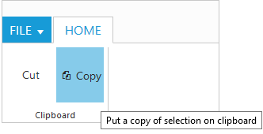
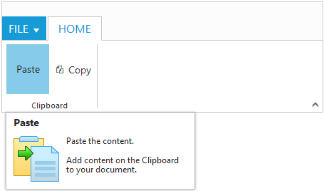

# Screen Tips 

ScreenTip/Tooltip is used to reduce the controls related Help that are needed to the end user to do control related actions.

## HTML Tooltip

Standard `html tooltip` can be set using `ToolTip` property of each group item.


   
   <ej-ribbon id="defaultRibbon" width="20%" allow-resizing="true">
        <e-application-tab type=Menu menu-item-id="ribbonmenu">
        </e-application-tab>
        <e-tabs>
            <e-tab id="home" text="HOME">
                <e-groups>
                    <e-group text="Clipboard">
                        <e-content>
                            <e-contents>
                                <e-content-groups>
                                    <e-content-group id="cut" text="Cut" tool-tip="Remove the selection and put it on clipboard">
                                    </e-content-group>
                                    <e-content-group id="copy" text="Copy" tool-tip="Put a copy of selection on clipboard">
                                        <e-button-settings content-type=TextAndImage prefix-icon="e-icon e-ribbon e-ribboncopy">
                                        </e-button-settings>
                                    </e-content-group>
                                </e-content-groups>
                                <e-defaults width="60" height="70"></e-defaults>
                            </e-contents>
                        </e-content>
                    </e-group>
                </e-groups>
            </e-tab>
        </e-tabs>
   </ej-ribbon>
     
    <ul id="ribbonmenu">
        <li>
            <a>FILE</a>
            <ul>
                <li><a>New</a></li>
                <li><a>Open</a></li>
            </ul>
        </li>
    </ul>



## Custom Tooltip

Custom Tooltip is used to set detailed help to the user about the controls. You can set`Title`, `Content` and `PrefixIcon` class to customize the tooltip with icons.

### For Groups
 
`CustomTooltip` for each group controls can be specified. Such as to the controls Button, SplitButton, DropDownList etc.



   <ej-ribbon id="defaultRibbon" width="450">
        <e-application-tab type=Menu menu-item-id="ribbonmenu">
        </e-application-tab>
        <e-tabs>
            <e-tab id="home" text="HOME">
                <e-groups>
                    <e-group text="Clipboard">
                        <e-content>
                            <e-contents>
                                <e-content-groups>
                                    <e-content-group id="paste" text="Paste">
                                        <e-custom-tool-tip title="Paste" content="<h6>Paste the content.  Add content on the Clipboard to your document.</h6>" prefix-icon="e-pastetip">
                                        </e-custom-tool-tip>
                                    </e-content-group>
                                    <e-content-group id="copy" text="Copy">
                                        <e-custom-tool-tip title="Copy" content="<h6>Copy the content.</h6>">
                                        </e-custom-tool-tip>
                                        <e-button-settings content-type=TextAndImage prefix-icon="e-icon e-ribbon e-ribboncopy">
                                        </e-button-settings>
                                    </e-content-group>
                                </e-content-groups>
                                <e-defaults width="60" height="70"></e-defaults>
                            </e-contents>
                        </e-content>
                    </e-group>
                </e-groups>
            </e-tab>
        </e-tabs>
     </ej-ribbon>

     <ul id="ribbonmenu">
        <li>
            <a>FILE</a>
            <ul>
                <li><a>New</a></li>
                <li><a>Open</a></li>
            </ul>
        </li>
     </ul>
   
  @section StyleSection{
     <link href="@Url.Content("~/css/ejthemes/ribbon-css/ej.icons.css")" rel="stylesheet" />
      
   }



### For Gallery

`CustomTooltip` for each `Gallery` and `CustomGalleryItems` button control can be specified. 

N> Custom gallery item `Menu` is not supported to Custom tooltip.



<ej-ribbon id="defaultRibbon" width="500">
        <e-application-tab type=Menu menu-item-id="ribbonmenu">
        </e-application-tab>
        <e-tabs>
            <e-tab id="home" text="HOME">
                <e-groups>
                    <e-group text="Gallery" type="gallery">
                        <e-content>
                            <e-contents>
                                <e-content-groups>
                                    <e-content-group id="Gallery" columns="2" item-height="54" item-width="73" expanded-columns="3" type="Gallery">
                                        <e-gallery-items>
                                            <e-gallery-item text="Style 1">
                                                <e-custom-tool-tip title="Style 1" content="<I>Style 1 to customize the table</I>">
                                                </e-custom-tool-tip>
                                                <e-button-settings content-type=ImageOnly prefix-icon="e-icon e-gallerycontent1 e-gbtnimg" css-class="e-gbtnposition">
                                                </e-button-settings>
                                            </e-gallery-item>
                                            <e-gallery-item text="Style 2">
                                                <e-custom-tool-tip title="Style 2" content="<I>Style 2 to customize the table</I>">
                                                </e-custom-tool-tip>
                                                <e-button-settings content-type=ImageOnly prefix-icon="e-icon e-gallerycontent2 e-gbtnimg" css-class="e-gbtnposition">
                                                </e-button-settings>
                                            </e-gallery-item>
                                            <e-gallery-item text="Style 3">
                                                <e-custom-tool-tip title="Style 3" content="<I>Style 3 to customize the table</I>">
                                                </e-custom-tool-tip>
                                                <e-button-settings content-type=ImageOnly prefix-icon="e-icon e-gallerycontent3 e-gbtnimg" css-class="e-gbtnposition">
                                                </e-button-settings>
                                            </e-gallery-item>
                                            <e-gallery-item text="Style 4">
                                                <e-custom-tool-tip title="Style 4" content="<I>Style 4 to customize the table</I>">
                                                </e-custom-tool-tip>
                                                <e-button-settings content-type=ImageOnly prefix-icon="e-icon e-gallerycontent4 e-gbtnimg" css-class="e-gbtnposition">
                                                </e-button-settings>
                                            </e-gallery-item>
                                        </e-gallery-items>
                                        <e-custom-gallery-items>
                                            <e-custom-gallery-item text="Clear Formatting" tool-tip="Clear Formatting" custom-item-type=Button>
                                                <e-custom-tool-tip title="Clear Format" content="<I>To clear formatting</I>">
                                                </e-custom-tool-tip>
                                                <e-button-settings css-class="e-extrabtnstyle">
                                                </e-button-settings>
                                            </e-custom-gallery-item>
                                            <e-custom-gallery-item custom-item-type="Menu" menu-id="custommenu">
                                                <e-menu-settings open-on-click="false">
                                                </e-menu-settings>
                                            </e-custom-gallery-item>
                                        </e-custom-gallery-items>
                                    </e-content-group>
                                </e-content-groups>
                            </e-contents>
                        </e-content>
                    </e-group>
                </e-groups>
            </e-tab>
        </e-tabs>
  </ej-ribbon>
   <ul id="ribbonmenu">
        <li>
            <a>FILE</a>
        </li>
   </ul>
   <ul id="custommenu">
        <li>
            <a>New Quick Step</a>
            <ul>
                <li><a>Flag and Move</a></li>
            </ul>
        </li>
   </ul>
    
    
   @section StyleSection{
   <link href="@Url.Content("~/css/ejthemes/ribbon-css/ej.icons.css")" rel="stylesheet" />
    
   
   }



### For Expand Pin

Specifies the `Custom tooltip` for expand pin in the Ribbon. 



   <ej-ribbon id="defaultRibbon" width="300">
        <e-expand-pin-settings>
            <e-custom-tool-tip title="Collapse the Ribbon" content="<h6>Click the icon to collapse the Ribbon.</h6>">
            </e-custom-tool-tip>
        </e-expand-pin-settings>
        <e-application-tab type=Menu menu-item-id="ribbonmenu">
            <e-menu-settings open-on-click="false">
            </e-menu-settings>
        </e-application-tab>
        <e-tabs>
            <e-tab id="home" text="HOME">
                <e-groups>
                    <e-group text="New" align-type=Rows>
                        <e-content>
                            <e-contents>
                                <e-content-groups>
                                    <e-content-group id="new" text="New" tool-tip="New">
                                        <e-button-settings content-type=ImageOnly image-position=ImageTop prefix-icon="e-icon e-ribbon e-new">
                                        </e-button-settings>
                                    </e-content-group>
                                </e-content-groups>
                                <e-defaults type=Button width="60" height="70"></e-defaults>
                            </e-contents>
                        </e-content>
                    </e-group>
                </e-groups>
            </e-tab>
        </e-tabs>
   </ej-ribbon>
   <ul id="ribbonmenu">
        <li>
            <a>FILE</a>
            <ul>
                <li><a>New</a></li>
                <li><a>Open</a></li>
            </ul>
        </li>
   </ul>
    
   @section StyleSection{
   <link href="@Url.Content("~/css/ejthemes/ribbon-css/ej.icons.css")" rel="stylesheet" />
   }



### For Collapse Pin

Specifies the `Custom tooltip` for collapse pin in the Ribbon. 



   <ej-ribbon id="defaultRibbon" width="300">
        <e-collapse-pin-settings>
            <e-custom-tool-tip title="Pin the Ribbon" content="<h6>Keep it open while you work</h6>">
            </e-custom-tool-tip>
        </e-collapse-pin-settings>
        <e-application-tab type=Menu menu-item-id="ribbonmenu">
            <e-menu-settings open-on-click="false">
            </e-menu-settings>
        </e-application-tab>
        <e-tabs>
            <e-tab id="home" text="HOME">
                <e-groups>
                    <e-group text="New" align-type=Rows>
                        <e-content>
                            <e-contents>
                                <e-content-groups>
                                    <e-content-group id="new" text="New" tool-tip="New">
                                        <e-button-settings content-type=ImageOnly image-position=ImageTop prefix-icon="e-icon e-ribbon e-new">
                                        </e-button-settings>
                                    </e-content-group>
                                </e-content-groups>
                                <e-defaults type=Button width="60" height="70"></e-defaults>
                            </e-contents>
                        </e-content>
                    </e-group>
                </e-groups>
            </e-tab>
        </e-tabs>
   </ej-ribbon>
   <ul id="ribbonmenu">
        <li>
            <a>FILE</a>
            <ul>
                <li><a>New</a></li>
                <li><a>Open</a></li>
            </ul>
        </li>
   </ul>
                


### For GroupExpander

`Custom tooltip` for each group expander can be specified.



   <ej-ribbon id="defaultRibbon" width="300">
        <e-application-tab type=Menu menu-item-id="ribbonmenu">
            <e-menu-settings open-on-click="false">
            </e-menu-settings>
        </e-application-tab>
        <e-tabs>
            <e-tab id="home" text="HOME">
                <e-groups>
                    <e-group text="New" align-type=Rows enable-group-expander="true">
                        <e-group-expander-settings>
                            <e-custom-tool-tip title="Clipboard" content="<h6>Show a popup for the Clipboard group.</h6>">
                            </e-custom-tool-tip>
                        </e-group-expander-settings>
                        <e-content>
                            <e-contents>
                                <e-content-groups>
                                    <e-content-group id="new" text="New" tool-tip="New">
                                        <e-button-settings content-type=ImageOnly image-position=ImageTop prefix-icon="e-icon e-ribbon e-new">
                                        </e-button-settings>
                                    </e-content-group>
                                </e-content-groups>
                                <e-defaults type=Button width="60" height="70"></e-defaults>
                            </e-contents>
                        </e-content>
                    </e-group>
                </e-groups>
            </e-tab>
        </e-tabs>
   </ej-ribbon>
   <ul id="ribbonmenu">
        <li>
            <a>FILE</a>
            <ul>
                <li><a>New</a></li>
                <li><a>Open</a></li>
            </ul>
        </li>
   </ul>
                


