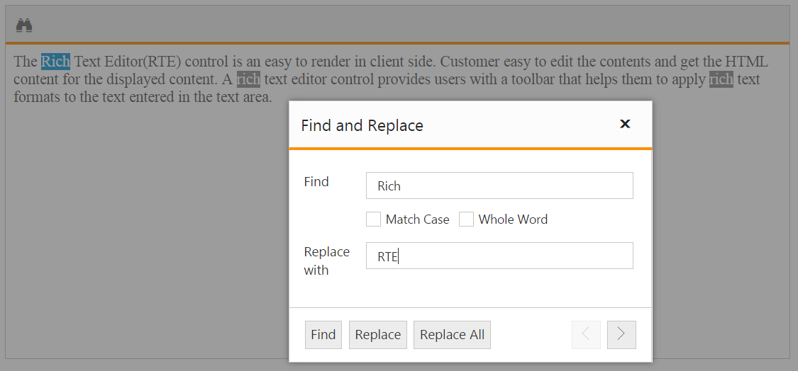

# Find and Replace

RTE provides find and replace support, which is used to search for a keyword in RTE content and replace the matched keyword with a specified text. In order to use it, we have to enable the find and replace item in the editor toolbar (or) Press CTRL+F key.  

	

@{
List<String> toolsList = new List<string>() { "edit" };
List<String> find = new List<string>() { "findAndReplace" };
}
<ej-rte id="rteSample" tools-list="toolsList" width="820px">
    <e-content-template>
        

            The Rich Text Editor(RTE) control is an easy to render in client side. Customer easy to edit the contents
            and get the HTML content for the displayed content. A rich text editor control provides
            users with a toolbar that helps them to apply rich text formats to the text entered
            in the text area.
        

    </e-content-template>
    <e-tools edit="find"></e-tools>
</ej-rte>
    


* Find and Replace action should happen in a following sequence:

    Find => Replace (or) Replace All.
<table>
<tr>
<th>
Action
</th>
<th>
Descriptions 
</th>
</tr>
<tr>
<td>
Find
</td>
<td>
Finds a keyword matches with the editor content.it consist of following filters.
* Match Case.
* Whole Word.
</td>
</tr>
<tr>
<td>
Replace
</td>
<td>
Replaces the particular selected match with the specified text.
</td>
</tr>
<tr>
<td>
ReplaceAll
</td>
<td>
Replaces the entire matches with the specified text.
</td>
</tr>
</table>

N> Before performing the Replace/ReplaceAll action, we must do the find action to validate the match’s availability.