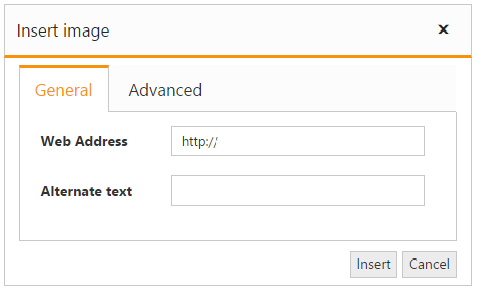

# Image and File browser

The editor allows you to manage the images and files using **FileExplorer**. The FileExplorer enables you to insert images from online source as well as local computer where you want to insert the image in your content. The Image and file browser is the ability to upload pictures and link file to the editor. 

# Insert an Image from Online Source

If you want to insert an image from online source like Google, ping, etc., you need to enable images tool on the editor’s toolbar. By default, the images tool is open a simple dialog which allows you to inserting an image from online source.



@{
    List<String> toolsList = new List<string>() { "images" };
    List<String> images = new List<string>() { "image" };
}

<ej-rte id="rteSample" width="820px" tools-list="toolsList">
<e-content-template>
    

        The Rich Text Editor(RTE) control is an easy to render in client side. Customer easy to edit the contents
        and get the HTML content for the displayed content. A rich text editor control provides
        users with a toolbar that helps them to apply rich text formats to the text entered
        in the text area.
    

</e-content-template>
<e-tools images="images"></e-tools>
</ej-rte>



