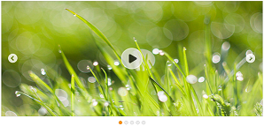

# Getting Started

ASP.NET Core Rotator provides support to display the provided number of images within your web page in a rotating manner. Refer the following guidelines to create a Rotator control for a real-time website banner scenario that has five images that slide automatically. When you click the play button, images slide automatically in a rotating manner and on second click, the rotation stops. This section explains briefly about how to create a Rotator in your ASP.NET Core application.

## Create a Simple Rotator

Essential Studio ASP.NET Core Rotator control has built-in features such as unobtrusive and flexible APIs. Refer the [Getting Started]( https://help.syncfusion.com/aspnet-core/gettingstarted/getting-started-1-1-0 ) page of the Introduction part to know more about the basic system requirements and the steps to configure the Syncfusion components in an ASP.NET Core application. 
You can easily create the Rotator control by adding the following code in corresponding view page.



    

        <ej-rotator id="content" slide-width="100%" slide-height="350px" is-responsive="true" show-play-button="true">
            <e-rotator-items>
            <e-rotator-item>
                <e-content-template>
                    

                        
                    

                </e-content-template>
            </e-rotator-item>
            <e-rotator-item>
                <e-content-template>
                    

                        
                    

                </e-content-template>
            </e-rotator-item>
            <e-rotator-item>
                <e-content-template>
                    

                        
                    

                </e-content-template>
            </e-rotator-item>
            <e-rotator-item>
                <e-content-template>
                    

                        
                    

                </e-content-template>
            </e-rotator-item>
            <e-rotator-item>
                <e-content-template>
                    

                        
                    

                </e-content-template>
            </e-rotator-item>
            </e-rotator-items>
        </ej-rotator>

    



Add following code in style section.



        .frame {
            width: 100%;
            box-sizing: border-box;
        }

        #content > li .image {
            width: 100%;
            height: 350px;
        }
   



The following banner is displayed as output.

