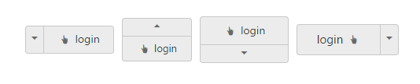

# Arrow Position

To provide a good look and feel for Split Button, position of arrow in Split Button is important. Using arrow-position property, you can easily customize the position of arrow inside Split Button without using any complex CSS. ArrowPosition property is applicable for both Split Button and Dropdown Button. This property represent the position of arrow with menu content.

_List of arrow position_

<table>
<tr>
<td>
Left</td><td>
Support for arrow in left.</td></tr>
<tr>
<td>
Right</td><td>
Support for arrow in right. </td></tr>
<tr>
<td>
Top</td><td>
Support for arrow in top. </td></tr>
<tr>
<td>
Bottom</td><td>
Support for arrow in bottom.</td></tr>
</table>

The following steps explain you the details on rendering the Split Button with above mentioned arrow position options.

1. In the View page, add the following button elements to configure Split Button widget.



	

    @*Add the code in the CSHTML page to configure and initialize the control*@

    @*Set the content for split button control as follows. *@

    <table>

        <tr>

            <td class="btnsht">

                

                    <ej-split-button id="spltbutton_normal_imageLeft" text="login" size="@ButtonSize.Medium" show-rounded-corner="true" content-type="@ContentType.TextAndImage" prefix-icon="e-icon e-handup" target-id="Ul11" image-position="@ImagePosition.ImageLeft" arrow-position="@ArrowPosition.Left"></ej-split-button>

                    <ul id="Ul11">

                        <li>User</li>

                        <li>Guest</li>

                        <li>Admin</li>

                    </ul>

                

            </td>

            <td>
                <ej-split-button id="spltbutton_small_imageLeft" text="login" size="@ButtonSize.Small" show-rounded-corner="true" target-id="Ul21" content-type="@ContentType.TextAndImage" prefix-icon="e-icon e-handup" image-position="@ImagePosition.ImageLeft" arrow-position="@ArrowPosition.Top"></ej-split-button>
                <ul id="Ul21">

                    <li>User</li>

                    <li>Guest</li>

                    <li>Admin</li>

                </ul>

            </td>

            <td class="btnsht">
                <ej-split-button id="spltbutton_medium_imageLeft" text="login" size="@ButtonSize.Medium" show-rounded-corner="true" target-id="Ul31" content-type="@ContentType.TextAndImage" prefix-icon="e-icon e-handup" image-position="@ImagePosition.ImageLeft" arrow-position="@ArrowPosition.Bottom"></ej-split-button>

                <ul id="Ul31">

                    <li>User</li>

                    <li>Guest</li>

                    <li>Admin</li>

                </ul>

            </td>

            <td class="btnsht">

                <ej-split-button id="spltbutton_large_imageLeft" text="login" size="@ButtonSize.Large" content-type="@ContentType.TextAndImage" prefix-icon="e-icon e-handup" show-rounded-corner="true" target-id="Ul41" image-position="@ImagePosition.ImageRight" arrow-position="@ArrowPosition.Right"></ej-split-button>

                <ul id="Ul41">

                    <li>User</li>

                    <li>Guest</li>

                    <li>Admin</li>

                </ul>

            </td>
        </tr>

    </table>


  

2. Execute the above code to render the following output.

