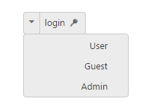

# RTL Support

In some cases it is necessary to use right to left alignment. RTL support is provided by using enable-rtl property. In RTL mode when there is more than one content (image/text, image/image) in Split Button, then the content is aligned in right to left format. For example, when text is in left and image is in right position, after applying right to left alignment these position are interchanged.

The following steps explains you the details about rendering the button with Right to left alignment support

1. In the VIEW page, add the following button elements to configure Split Button widget.



@*Add the code in the CSHTML page to configure and initialize the control*@

@*Enable the alignment format for split button control as follows.*@

        

            <ej-split-button id="dropdownbtn" text="login" size="@ButtonSize.Small" show-rounded-corner="true" target-id="menu1" enable-rtl="true" prefix-icon="e-icon e-login" content-type="@ContentType.TextAndImage"></ej-split-button>

            <ul id="menu1">

                <li>User</li>

                <li>Guest</li>

                <li>Admin</li>

            </ul>

        



Execute the above code to render the following output.

