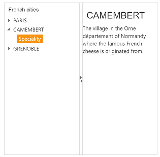

# Getting Started

ASP.NET Core Splitter control consists of movable split bar(s) that divides the container’s display area into two or more resizable and collapsible panes. Refer the following guidelines to create a Splitter, add tree view in the Splitter and how to set actions to view the image that is used to split the document or image and also Expand or Collapse the Splitter. This section explains briefly about how to create a Splitter in ASP.NET Core application.

## Create a Simple Splitter 

1.	Refer the [Getting Started]( https://help.syncfusion.com/aspnet-core/getting-started ) page of the Introduction part to know more about the basic system requirements and the steps to configure the Syncfusion components in an ASP.NET Core application.
2.	Add the following code example to the corresponding view page to render the Splitter. Here we have used the e-content-template property to specify the contents of the splitter control.

    

        <ej-splitter id="outterSplitter" is-responsive="true" height="400" width="402">
                <e-split-panes>
                    <e-split-pane paneSize="200">
                        <e-content-template>
                        Pane 1
                        </e-content-template>
                    </e-split-pane>
                    <e-split-pane paneSize="200">
                    <e-content-Template>
                        Pane 2
                        </e-content-Template>
                    </e-split-pane>
                </e-split-panes>
            </ej-splitter>

    

3. Now you can see below output.

## Configure Tree View

Add the following code example in the corresponding view page. 'html-attributes' property is used to add HTML attributes like, id, class etc. to the components.
Add below code to configure the tree view in your splitter control



            @{
                 IDictionary<string, object> cls = new Dictionary<string, object>()
                        { {"class","_child" }}; 
            }
        <ej-splitter id="outterSplitter" enableAutoResize="true" height="400" width="100%">
        <e-split-panes>
            <e-split-pane paneSize="200">
                <e-content-template>
                    

                        <h3 class="h3">French cities</h3>
                        <ej-tree-view id="ggh" node-select="treeClicked">
                            <e-tree-view-items  class="visibleHide">
                                <e-tree-view-item  text="PARIS"  >
                                    <e-tree-view-child-items>
                                        <e-tree-view-child-item id="tools" html-attributes="@cls" text="Speciality">
                                            <e-content-template >
                                                

                                                    <h3>PARIS</h3>
                                                    Paris, the city of lights and love - this short guide is full of ideas for how to make the most of the romanticism...
                                                

                                            </e-content-template>
                                           
                                        </e-tree-view-child-item>
    
                                    </e-tree-view-child-items>
                                </e-tree-view-item>
                                <e-tree-view-item  text="CAMEMBERT">
                                    <e-tree-view-child-items>
                                        <e-tree-view-child-item text="Speciality" id="chart" html-attributes="@cls"></e-tree-view-child-item>
                                    </e-tree-view-child-items>
                                </e-tree-view-item>
                                <e-tree-view-item text="GRENOBLE">
                                    <e-tree-view-child-items>
                                        <e-tree-view-child-item text="Speciality" id="grid" html-attributes="@cls"></e-tree-view-child-item>
                                    </e-tree-view-child-items>
                                </e-tree-view-item>
                            </e-tree-view-items>
                        </ej-tree-view>
                      

                </e-content-template>
            </e-split-pane>
            <e-split-pane paneSize="200">
                <e-content-Template>
                    

                        

                            Select any city from the tree to show the description.
                        

                        

                            <h3>PARIS</h3>
                            Paris, the city of lights and love - this short guide is full of ideas for how to make the most of the romanticism...
                        

                        

                            <h3>CAMEMBERT</h3>
                            The village in the Orne département of Normandy where the famous French cheese is originated from.
                        

                        

                            <h3>GRENOBLE</h3>
                            The capital city of the French Alps and a major scientific center surrounded by many ski resorts, host of the Winter Olympics in 1968.
                        

                    

                </e-content-Template>
            </e-split-pane>
        </e-split-panes>
     </ej-splitter>



Add following code in script section


     
        function treeClicked(sender, args) {
            if (sender.currentElement.hasClass('_child')) {
                var content = $('.' + sender.currentElement[0].id).html();
                $('._content').html(content);
            }
        }
 


Add following code in Style section



        .h3, ._content, p {
            font-size: 14px;
            margin-top: 10px;
            text-indent: 10px;
        }

        .des {
            display: none;
        }



Here we have added styles and JavaScripts for to get output as like given in the screenshot. Accordingly you can customize as per your requirement.

