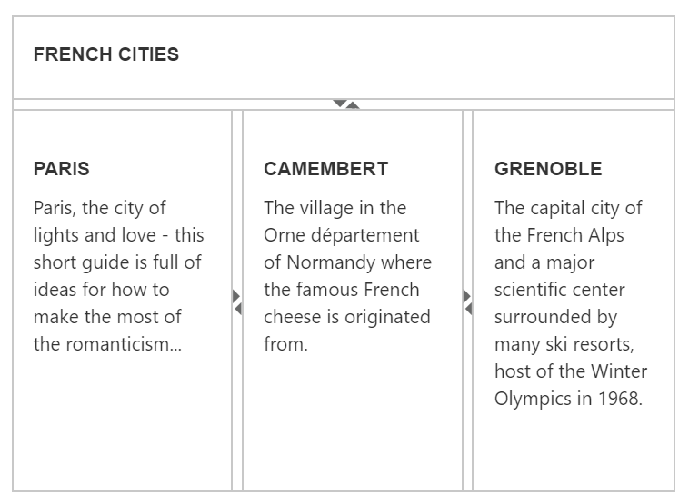

# Nested Splitter Support

The Splitter provides nested pane support that allows you to add a pane between two pane elements.

## Configure Nested Splitter

The following steps explain the implementation of the “Nested Splitter” option.

1. In the View page, add the Splitter helper and configure the outer and inner splitters. As you can see we have specified a helper function to render the inner splitter. A helper is a reusable snippet of Razor syntax exposed as a method, and is intended for rendering HTML to the browse. To use helper within another helper we have specified as a separate function as shown below.





@{Html.EJ().Splitter("outterSplitter").Height("300").Width("600").Orientation(Orientation.Vertical).PaneProperties(

p =>

{

	p.Add().ContentTemplate(

		@

			

				<h3 class="h3">

					ASP.NET MVC

				</h3>

			

		
).PaneSize("60");

	p.Add().ContentTemplate(

		@

			@innerSplitter()

		
);

}).Render();}

@helper innerSplitter()

{

@Html.EJ().Splitter("innerSplitter").Width("600").PaneProperties(p1 =>

			{

				p1.Add().ContentTemplate(@

					

						<h3 class="h3">

							Tools

						</h3>

					   Essential Tools is an collection of user interface components used to create interactive

						ASP.NET MVC applications.

					

				
).PaneSize("200");

				p1.Add().ContentTemplate(@

		

			<h3 class="h3">

				Chart

			</h3>

			Essential Chart is a business-oriented charting component.

		

	
).PaneSize("200");

				p1.Add().ContentTemplate(@

		

			<h3 class="h3">

				Grid

			</h3>

			Essential MVC Grid offers full featured a Grid control with extensive support for

			Grouping and the display of hierarchical data.

		

	
).PaneSize("200");

			})

}






 

The output for nested Splitter.

