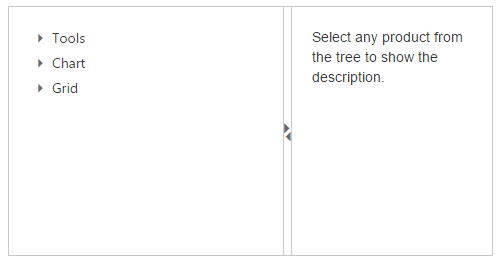
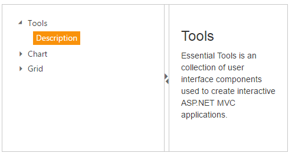

# Splitter Integration

The Splitter allows you to use other Essential ASP.NET MVC products inside the pane. The integrated function of those widgets can be used in other panes of the Splitter.

## Configuring other widgets in Splitter

The following steps explain the implementation of Splitter integration.

1. In the View page, add the Splitter helper and configure the elements within the split pane. The first pane has the TreeView content and the next one has some content that is related to TreeView.



@{IDictionary<string, object> htmlAttribute = new Dictionary<string, object>();
  htmlAttribute.Add("class", "_child");}@{Html.EJ().Splitter("outterSplitter").PaneProperties(p =>    {
  p.Add().ContentTemplate(
  @

  <h3 class="h3">
  ASP.NET MVC
  </h3>
  @Html.EJ().TreeView("treeview").Items(items =>
  {
      items.Add().Text("Mobile").Expanded(true).Children(child =>
	  {                        
	       child.Add().Id("tools").Text("Galaxy").HtmlAttributes(htmlAttribute);
		   });
		   items.Add().Text("Harddisk").Expanded(true).Children(child =>
		   { 
      		   child.Add().Id("chart").Text("Segate").HtmlAttributes(htmlAttribute);
		    });
		   items.Add().Text("Logo").Expanded(true).Children(child =>
		   {
			   child.Add().Id("grid").Text("Amazon").HtmlAttributes(htmlAttribute);
           });
  }).ClientSideEvents(e=>e.NodeSelect("treeClicked"))

).PaneSize("200");
p.Add().ContentTemplate(
@

Select any product from the tree to show the description.

<h3>
Tools 
</h3> 

Essential Tools is an collection of user interface components used to create interactive
ASP.NET MVC applications.

<h3> 
Chart 
</h3> 

 Essential Chart is a business-oriented charting component.
 

 

 
<h3>
Grid
</h3>

Essential MVC Grid offers full featured a Grid control with extensive support for
Grouping and the display of hierarchical data.

).PaneSize("200");
}).Height("400").Width("100%").Render();}



When the node is selected in TreeView, the integrated output is displayed in the second pane.

