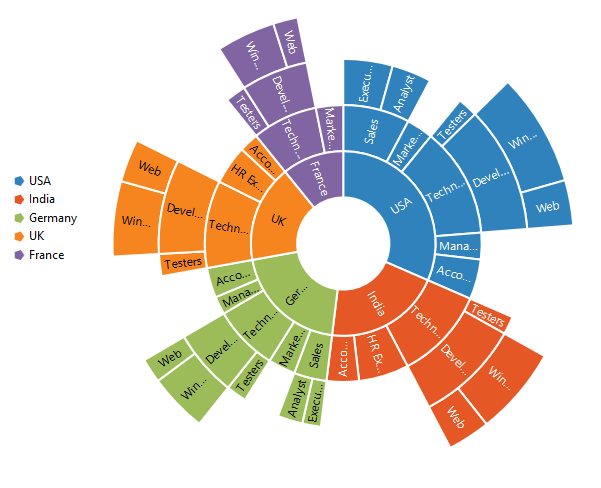

## Legend
The legend is used to represent the first level of items in the Sunburst Chart.The **e-sunburstchart-legend** can be initialized using the below code snippet



<ej-sunburstchart id="SunburstChart" >
<e-sunburstchart-legend visible="true" >
</e-sunburstchart-legend>
</ej-sunburstchart>

 

## Legend Icon 

You can specify different shapes of legend icon by using the **shape** property of the legend. By default, legend shape is **Circle**. The Sunburst chart has some predefined shapes such as:

* Circle
* Cross
* Diamond
* Pentagon
* Rectangle
* Triangle



<ej-sunburstchart id="SunburstChart" >
<e-sunburstchart-legend visible="true" shape="@SunburstLegendShape.Pentagon" >
</e-sunburstchart-legend>
</ej-sunburstchart>



 
## Positioning the Legend

By using the **position** property, you can position the legend at left, right, top or bottom of the chart. 



<ej-sunburstchart id="SunburstChart" >
<e-sunburstchart-legend visible="true" position="@SunburstLegendPosition.Top" >
</e-sunburstchart-legend>
</ej-sunburstchart>



 
### Customization

## Legend Item Size and border
You can change the size of the legend items by using the **LegendItemStyle-Width** and **LegendItemStyle-Height** properties. To change the legend item border, use **Border** property of the legend .



<ej-sunburstchart id="SunburstChart" >
<e-sunburstchart-legend visible="true" position="@SunburstLegendPosition.Top" >
<e-item-style height="13" width="13"></e-item-style>
<e-border color="#FF0000" width="1"></e-border>
</e-sunburstchart-legend>
</ej-sunburstchart>



## Legend Alignment

You can align the legend to the `center`, `far` or `near` based on its position by using the `legend-alignment` option.



<ej-sunburstchart  id="sunburst">   
<e-sunburstchart-legend visible="true" alignment="@SunburstLegendAlignment.Near" >
</e-sunburstchart-legend>
</ej-sunburstchart>



## Legend  Size 

By default, legend takes 20% of the height horizontally when it was placed on the top or bottom position and 20% of the width vertically while placing on the left or right position of the chart. You can change this default legend size by using the **size** property of the legend.



<ej-sunburstchart id="SunburstChart" >
<e-sunburstchart-legend visible="true" position="@SunburstLegendPosition.Top" >
<e-sunburstchart-size height="75" width="200"></e-sunburstchart-size>
</e-sunburstchart-legend>
</ej-sunburstchart>



## Legend title

To add the title to the legend, you have to specify the `legend-title`  option.



<ej-sunburstchart  id="sunburst">   
    <e-sunburstchart-legend title=""></e-sunburstchart-legend>
</ej-sunburstchart>



## Customize the legend text

To customize the legend item text and title you can use the `legend-title-font` and `legend-title` options. You can change the legend title alignment by using the `legend-title-textAlignment` option of the legend title.



<ej-sunburstchart  id="sunburst">   
    <e-sunburstchart-legend title="">
    <e-sunburstchart-font font-family="Arial" font-style="italic" size="15px" text-alignment=""></e-sunburstchart-font>
    </e-sunburstchart-legend>
</ej-sunburstchart>



## Legend Row and Column

You can arrange the legend items horizontally and vertically by using the **row-count** and **column-count** properties of the legend.
•	When only the rowCount is specified, the legend items are arranged according to the rowCount and number of columns may vary based on the number of legend items.
•	When only the columnCount is specified, the legend items are arranged according to the columnCount and number of rows may vary based on the number of legend items.
•	When both the properties are specified, then the one which has higher value is given preference. For example, when the rowCount is 4 and columnCount is 3, legend items are arranged in 4 rows.
•	When both the properties are specified and have the same value, the preference is given to the columnCount when it is positioned at the top/bottom position. The preference is given to the rowCount when it is positioned at the left/right position.
 


<ej-sunburstchart id="SunburstChart" >
<e-sunburstchart-legend visible="true" position="@SunburstLegendPosition.Top" 
row-count="2" column-count="3">
</e-sunburstchart-legend>
</ej-sunburstchart>



 
## LegendInteractivity

You can select a specific category while clicking on corresponding legend item through **click-action** property. 

It has three types of action
*	ToggleSegmentSelection
*	ToggleSegmentVisibility
*	None

## ToggleSegmentSelection

Used to highlight specific category while clicking on legend item



<ej-sunburstchart id="SunburstChart" >
<e-sunburstchart-legend visible="true" position="@SunburstLegendPosition.Top" 
click-action="@SunburstLegendClickAction.ToggleSegmentSelection">
</e-sunburstchart-legend>
</ej-sunburstchart>



 
## Toggle Segment Visibility

Used to disable the specific category while clicking on legend item.



<ej-sunburstchart id="SunburstChart" >
<e-sunburstchart-legend visible="true" position="@SunburstLegendPosition.Top" 
click-action="@SunburstLegendClickAction.ToggleSegmentVisibility">
</e-sunburstchart-legend>
</ej-sunburstchart>



