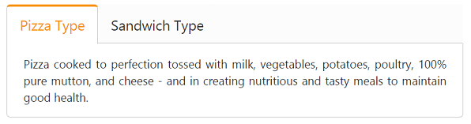
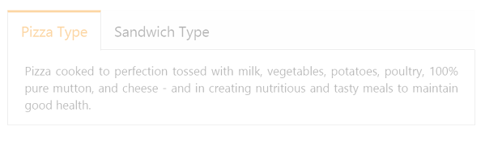
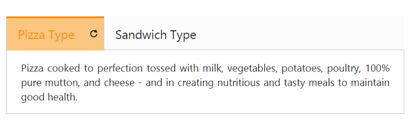
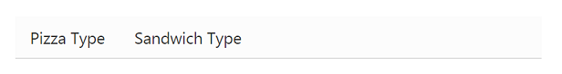

# Appearance and Styling

## Header Image Customization

To set the Tab header image for each Tab item you need to specify image in “ImageCssClass” property during the TabItem declaration.

The following code example is used to add the header image for the root Tab header element. 

1. Add the following code in your view page to render Tab with header image.



   

        <ul>

            <li><a href="#pizzatype">Pizza Type</a></li>

            <li><a href="#sandwichtype">Sandwich Type</a></li>

        </ul>

        

            
Pizza cooked to perfection tossed with milk, vegetables, potatoes, poultry, 100% pure mutton, and cheese - and in creating nutritious and tasty meals to maintain good health.

        

        

            
Sandwich cooked to perfection tossed with bread, milk, vegetables, potatoes, poultry, 100% pure mutton, and cheese - and in creating nutritious and tasty meals to maintain good health.

        

        <ej-tab id="dishtab"></ej-tab>

    



2. Add following CSS for header image customization.



	 


   
3. The following screenshot illustrates the Tab with the customized header image. 

Header Image Customization
{:.caption}

## Rounded corner

By enabling ‘ShowRoundedCorner’ property, you can customize the shape of the Tab widget from regular rectangular shape to rounded rectangle shape that is set to ‘false’ by default. 

The following code example is used to render the Tab widget with rounded corner.

1. Add the following code in your view page to render Tab with rounder corner.



// Add the following code example to the corresponding CSHTML page to render Tab with rounded corner.

	<ej-tab id="tabSample" show-rounded-corner="true">
		<e-tab-items>
			<e-tab-item id="pizzatype" text="Pizza Type">
				<e-content-template>
					

						Pizza cooked to perfection tossed with milk, vegetables, potatoes, poultry, 100% pure mutton, and cheese - and in creating nutritious and tasty meals to maintain good health.
					

				</e-content-template>
			</e-tab-item>
			<e-tab-item id="sandwichtype" text="Sandwich Type">
				<e-content-template>
					

						Sandwich cooked to perfection tossed with bread, milk, vegetables, potatoes, poultry, 100% pure mutton, and cheese - and in creating nutritious and tasty meals to maintain good health.
					

				</e-content-template>
			</e-tab-item>
		</e-tab-items>
	</ej-tab>



2. The following screenshot illustrates the Tab with Rounded corner.

Tab with rounded corner
{:.caption}

## Enable/Disable

You can enable or disable the Tab widget by ‘Enabled’ property. By default, the property set to ‘true’.

The following code example is used to render the Tab widget with enable/disable.

1. Add the following code in your view page to render Tab with enable/disable.



// Add the following code example to the corresponding CSHTML page to render Tab with Enable/Disable format.

<ej-tab id="tabSample" enabled="false">
	<e-tab-items>
		<e-tab-item id="pizzatype" text="Pizza Type">
			<e-content-template>
				

					Pizza cooked to perfection tossed with milk, vegetables, potatoes, poultry, 100% pure mutton, and cheese - and in creating nutritious and tasty meals to maintain good health.
				

			</e-content-template>
		</e-tab-item>
		<e-tab-item id="sandwichtype" text="Sandwich Type">
			<e-content-template>
				

					Sandwich cooked to perfection tossed with bread, milk, vegetables, potatoes, poultry, 100% pure mutton, and cheese - and in creating nutritious and tasty meals to maintain good health.
				

			</e-content-template>
		</e-tab-item>
	</e-tab-items>
</ej-tab>



2. The following screenshot illustrates the Tab with disabled format.

Tab with disabled format
{:.caption}

## Enabling Reload Icon

Without refresh/reload the whole page, you can reload a particular Tab using Reload icon. The Reload icon is appeared at right corner of the Tab by enabling the property ‘ShowReloadIcon’ to ‘true’. When you move cursor over the Tab headers, the Reload icon is displayed. By default the property value is set to ‘false’.   

The following code example is used to render the Tab widget with Reload icon.

1. Add the following code in your view page to render Tab with Reload icon.



// Add the following code example to the corresponding CSHTML page to render Tab with reload icon.

<ej-tab id="tabSample" show-reload-icon="true">
	<e-tab-items>
		<e-tab-item id="pizzatype" text="Pizza Type">
			<e-content-template>
				

					Pizza cooked to perfection tossed with milk, vegetables, potatoes, poultry, 100% pure mutton, and cheese - and in creating nutritious and tasty meals to maintain good health.
				

			</e-content-template>
		</e-tab-item>
		<e-tab-item id="sandwichtype" text="Sandwich Type">
			<e-content-template>
				

					Sandwich cooked to perfection tossed with bread, milk, vegetables, potatoes, poultry, 100% pure mutton, and cheese - and in creating nutritious and tasty meals to maintain good health.
				

			</e-content-template>
		</e-tab-item>
	</e-tab-items>
</ej-tab>



2. The following screenshot illustrates the Tab with Reload icon.

Tab with reload icon

{:.caption}

## Collapsible Tabs

You can collapse the Tab content by enabling the ‘Collapsible’ property to ‘true’. When the property is set to ‘true’ then click the active Tab header, the Tab contents are hided. By default, the property value is set to ‘false’.

The following code example is used to render the Tab widget with customized collapsible mode.

1. Add the following code in your view page to render Tab with customized collapsible mode.



// Add the following code example to the corresponding CSHTML page to render Tab with collapsible mode.

<ej-tab id="tabSample" collapsible="true">
	<e-tab-items>
		<e-tab-item id="pizzatype" text="Pizza Type">
			<e-content-template>
				

					Pizza cooked to perfection tossed with milk, vegetables, potatoes, poultry, 100% pure mutton, and cheese - and in creating nutritious and tasty meals to maintain good health.
				

			</e-content-template>
		</e-tab-item>
		<e-tab-item id="sandwichtype" text="Sandwich Type">
			<e-content-template>
				

					Sandwich cooked to perfection tossed with bread, milk, vegetables, potatoes, poultry, 100% pure mutton, and cheese - and in creating nutritious and tasty meals to maintain good health.
				

			</e-content-template>
		</e-tab-item>
	</e-tab-items>
</ej-tab>

	


2. The following screenshot illustrates the Tab with customized collapsible mode.

Tab with customized collapsible mode
{:.caption}

## Adjusting Tab Size

### Height Adjust Mode and Height

The height of the Tab widget is customized by ‘height’ property. The Tab widget height depends on ‘HeightAdjustMode’ property. Using the HeightAdjustMode property, you can adjust height by “Content”, “Auto”, “Fill”. By default the HeightAdjustMode is set as content.

The following code example is used to render the Tab widget with customized height and height adjust mode.

1. Add the following code in your view page to render Tab with customized height and height adjust mode.



	// Add the following code example to the corresponding CSHTML page to render Tab with customized height and height adjust mode.
    

        <ej-tab id="tabSample" height="300px" height-adjust-mode="@HeightAdjustMode.Fill">
            <e-tab-items>
                <e-tab-item id="pizzatype" text="Pizza Type">
                    <e-content-template>
                        

                            Pizza cooked to perfection tossed with milk, vegetables, potatoes, poultry, 100% pure mutton, and cheese - and in creating nutritious and tasty meals to maintain good health.
                        

                    </e-content-template>
                </e-tab-item>
                <e-tab-item id="sandwichtype" text="Sandwich Type">
                    <e-content-template>
                        

                            Sandwich cooked to perfection tossed with bread, milk, vegetables, potatoes, poultry, 100% pure mutton, and cheese - and in creating nutritious and tasty meals to maintain good health.
                        

                    </e-content-template>
                </e-tab-item>
            </e-tab-items>
        </ej-tab>

    



2. The following screenshot illustrates the Tab with customized height and height adjust mode.

Tab with customized height and height adjust mode
{:.caption}

### Width

The width of the Tab widget is customized by using ‘Width’ property that accepts only the pixel values.

The following code example is used to render the Tab widget with customized width.

1. Add the following code in your view page to render Tab with customized width.



// Add the following code example to the corresponding CSHTML page to render Tab with customized width.

<ej-tab id="tabSample" width="450">
	<e-tab-items>
		<e-tab-item id="pizzatype" text="Pizza Type">
			<e-content-template>
				

					Pizza cooked to perfection tossed with milk, vegetables, potatoes, poultry, 100% pure mutton, and cheese - and in creating nutritious and tasty meals to maintain good health.
				

			</e-content-template>
		</e-tab-item>
		<e-tab-item id="sandwichtype" text="Sandwich Type">
			<e-content-template>
				

					Sandwich cooked to perfection tossed with bread, milk, vegetables, potatoes, poultry, 100% pure mutton, and cheese - and in creating nutritious and tasty meals to maintain good health.
				

			</e-content-template>
		</e-tab-item>
	</e-tab-items>
</ej-tab>


   
2. The following screenshot illustrates the Tab with customized width.

' 

Tab with customized width
{:.caption}

## Theme

Tab control’s style and appearance are controlled based on CSS classes. In order to apply styles to the Tab control, you can refer 2 files namely, ej.widgets.core.min.css and ej.theme.min.css. When the file ej.widgets.all.min.css is referred, then it is not necessary to include the files ej.widgets.core.min.css and ej.theme.min.css in your project, as ej.widgets.all.min.css is the combination of these two. 

By default, there are 13 themes support available for Tab control namely

* default-theme
* bootstrap-theme
* flat-azure-dark
* fat-lime
* flat-lime-dark
* flat-saffron
* flat-saffron-dark
* gradient-azure
* gradient-azure-dark
* gradient-lime
* gradient-lime-dark
* gradient-saffron
* gradient-saffron-dark

## Custom styles

The style of the Tab widget is customized by ‘CssClass’ property. 

The following code example is used to render the Tab widget with customized style.

1. Add the following code in your view page to render Tab with customized style.



// Add the following code example to the corresponding CSHTML page to render Tab with customized style.

<ej-tab id="tabSample" css-class="custom">
	<e-tab-items>
		<e-tab-item id="pizzatype" text="Pizza Type">
			<e-content-template>
				

					Pizza cooked to perfection tossed with milk, vegetables, potatoes, poultry, 100% pure mutton, and cheese - and in creating nutritious and tasty meals to maintain good health.
				

			</e-content-template>
		</e-tab-item>
		<e-tab-item id="sandwichtype" text="Sandwich Type">
			<e-content-template>
				

					Sandwich cooked to perfection tossed with bread, milk, vegetables, potatoes, poultry, 100% pure mutton, and cheese - and in creating nutritious and tasty meals to maintain good health.
				

			</e-content-template>
		</e-tab-item>
	</e-tab-items>
</ej-tab>



2. Add the following styles



	

	

3. The following screenshot illustrates the Tab with customized style.

Tab with customized style
{:.caption}