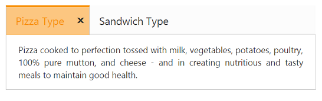
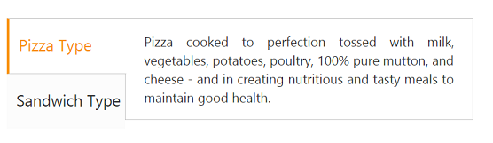

# Behavior Settings

## Close Button

By default, Tab contents are rendered without CloseButton. You can add the CloseButton by setting the ‘ShowCloseButton’ property to ‘true’. When you move cursor over the Tab headers, the CloseButton is displayed.   

The following code example is used to render the Tab widget with CloseButton.

1. Add the following code in your view page for simple Tab creation with CloseButton.


   
// Add the following code example to the corresponding CSHTML page to render Tab with close button.

    <ej-tab id="tabSample" show-close-button="true">
        <e-tab-items>
            <e-tab-item id="pizzatype" text="Pizza Type">
                <e-content-template>
                    

                        Pizza cooked to perfection tossed with milk, vegetables, potatoes, poultry, 100% pure mutton, and cheese - and in creating nutritious and tasty meals to maintain good health.
                    

                </e-content-template>
            </e-tab-item>
            <e-tab-item id="sandwichtype" text="Sandwich Type">
                <e-content-template>
                    

                        Sandwich cooked to perfection tossed with bread, milk, vegetables, potatoes, poultry, 100% pure mutton, and cheese - and in creating nutritious and tasty meals to maintain good health.
                    

                </e-content-template>
            </e-tab-item>
        </e-tab-items>
    </ej-tab>



2. The following screenshot illustrates the Tab with CloseButton. 

## Orientation

By default, Tab control renders in horizontal orientation. You can change the Orientation to vertical using the ‘HeaderPosition’ property. Using  this property, you can customize the header by ” Top”,” Bottom”, “Left”, and  “Right”.

The following code example is used to render the sub Tab widget in the vertical orientation. 

1. Add the following code in your view page for Tab orientation.


   
// Add the following code example to the corresponding CSHTML page to render Tab with customized orientation.

    <ej-tab id="tabSample" header-position="@HeaderPosition.Left" height="220px">
        <e-tab-items>
            <e-tab-item id="pizzatype" text="Pizza Type">
                <e-content-template>
                    

                        Pizza cooked to perfection tossed with milk, vegetables, potatoes, poultry, 100% pure mutton, and cheese - and in creating nutritious and tasty meals to maintain good health.
                    

                </e-content-template>
            </e-tab-item>
            <e-tab-item id="sandwichtype" text="Sandwich Type">
                <e-content-template>
                    

                        Sandwich cooked to perfection tossed with bread, milk, vegetables, potatoes, poultry, 100% pure mutton, and cheese - and in creating nutritious and tasty meals to maintain good health.
                    

                </e-content-template>
            </e-tab-item>
        </e-tab-items>
    </ej-tab>



2. The following screenshot illustrates the sub Tab with vertical orientation. 

## State Maintenance

When the page gets refreshed or reloaded, the Tab state is changed (i.e.) the focus is moved to start Tab. You can maintain the state of the Tab by using ‘EnablePersistence’ property. When this property is set to ‘true’, it retains the state. 

The following code example is used to render the Tab widget with state maintenance. 

1. Add the following code in your view page for Tab state maintenance.



// Add the following code example to the corresponding CSHTML page to render Tab with state maintenance.

    <ej-tab id="tabSample" enable-persistence="true">
        <e-tab-items>
            <e-tab-item id="pizzatype" text="Pizza Type">
                <e-content-template>
                    

                        Pizza cooked to perfection tossed with milk, vegetables, potatoes, poultry, 100% pure mutton, and cheese - and in creating nutritious and tasty meals to maintain good health.
                    

                </e-content-template>
            </e-tab-item>
            <e-tab-item id="sandwichtype" text="Sandwich Type">
                <e-content-template>
                    

                        Sandwich cooked to perfection tossed with bread, milk, vegetables, potatoes, poultry, 100% pure mutton, and cheese - and in creating nutritious and tasty meals to maintain good health.
                    

                </e-content-template>
            </e-tab-item>
        </e-tab-items>
    </ej-tab>


   
2. The following screenshot illustrates the Tab with State maintenance.

State before page refresh

{:.caption}

