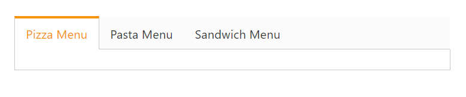
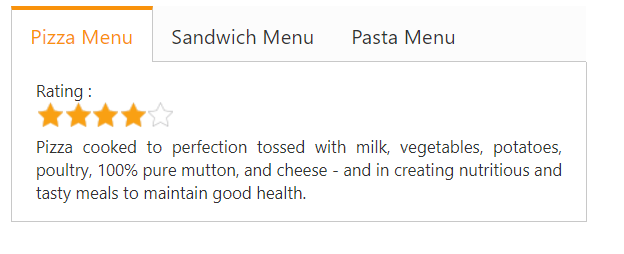
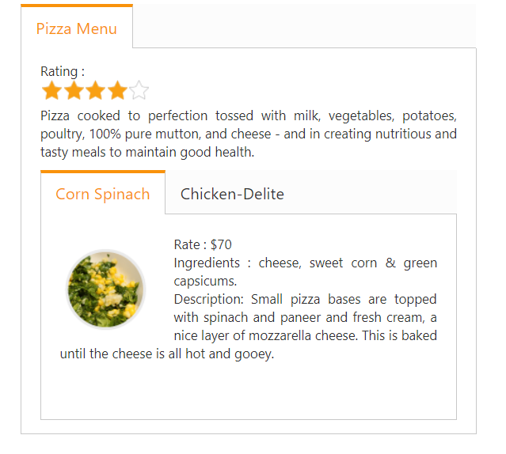
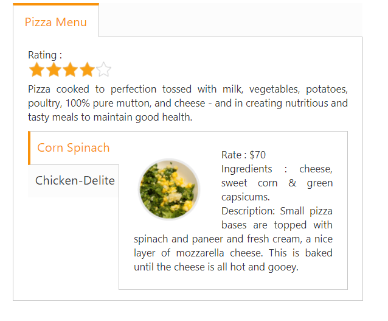
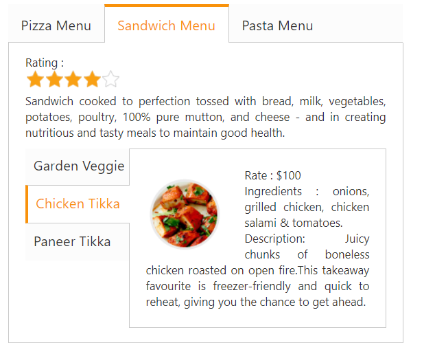

# Getting Started 

This section briefly explains how to create a tab control in your application with ASP.NET Core.

## Create your first tab control in ASP.NET Core

The ASP.NET Core tab control is an interface that displays the content in multiple sections. A tab panel consists of HeaderText as well as a ContentTemplate. It is useful for a dashboard that is having limited space. The following section guides you to customize the tab for displaying Hotel menu items, its rate details, and the ingredients on demand.

Tab control with Hotel Menu items
{:.caption}

### Create tab control

The ASP.NET Core tab widget basically builds a dynamic, interactive, and menu-driven interface from your content. The content can be a text, graphics, or HTML. You can create the tab headers using the Text and Content template property.

The following steps are used to create a tab control.

1. Create a core project, and add necessary assembly and script with the help of the given [Dotnet Core-Getting Started](https://help.syncfusion.com/aspnet-core/getting-started) documentation.
2. Add the mentioned code to the corresponding view page for tab rendering.
  


/*ej-Tag Helper code to render Tab*/

    <ej-tab id="tabSample">
        <e-tab-items>
            <e-tab-item id="Pizza" text="Pizza Menu">
                <e-content-template></e-content-template>
            </e-tab-item>
            <e-tab-item id="Pasta" text="Pasta Menu">
                <e-content-template></e-content-template>
            </e-tab-item>
            <e-tab-item id="sandwizza" text="Sandwizza Menu">
                <e-content-template></e-content-template>
            </e-tab-item>
        </e-tab-items>
    </ej-tab>





 /*Razor code to render Tab*/

@{ Html.EJ().Tab("DishType").Items(data =>
	{
		data.Add().ID("pizzamenu").Text("Pizza Menu").ContentTemplate(@

);
		data.Add().ID("pizzatype").Text("Pizza Type").ContentTemplate(@

);
		data.Add().ID("sandwichtype").Text("Sandwich Type").ContentTemplate(@

);
	}).Render();
    }



N> To render the tab control use either Razor or Tag helper code as given in the previous code snippet.
 
The following output will be displayed.

' 

Tab control with Header

{:.caption}

### Configure content

In this application, a detailed description is provided to each item. You can specify the contents in the tab section within the content template.
 


/*ej-Tag Helper code to render Tab*/

<ej-tab id="DishType">
    <e-tab-items>
        <e-tab-item id="pizzamenu" text="Pizza Menu">
            <e-content-template>
                

                    <ej-rating id="RatingPizza" value="4" precision="@Precision.Exact" />
                    <!--Food item description-->

                    
Pizza cooked to perfection tossed with milk, vegetables, potatoes, poultry, 100% pure mutton, and cheese - and in creating nutritious and tasty meals to maintain good health.

                

            </e-content-template>
        </e-tab-item>
        <e-tab-item id="pizzatype" text="Pizza Type">
            <e-content-template></e-content-template>
        </e-tab-item>
        <e-tab-item id="sandwichtype" text="Sandwizza Type">
            <e-content-template></e-content-template>
        </e-tab-item>
    </e-tab-items>
</ej-tab>





/*Razor code to render Tab*/

@Html.EJ().Tab("DishType").Items(data =>

{

data.Add().ID("pizzamenu").Text("Pizza Menu").ContentTemplate(@

    Rating:

    @Html.EJ().Rating("RatingPizza").Value(4).Precision(Precision.Exact)

    <!--Food item description-->

    
Pizza cooked to perfection tossed with milk, vegetables, potatoes, poultry, 100% pure mutton, and cheese - and in creating nutritious and tasty meals to maintain good health.

);

})



You can provide more customization to the tab by using rating control to describe an item’s price.

### Create the rating

The ASP.NET Core rating control provides an intuitive rating experience. It allows you to select the number of stars that represents the rating. The following code example explains you the creation of rating control. Create the rating control using HTML helper, and render the rating control and its description inside the content template in first tab control.

For more information about rating, refer to the following link:

<https://help.syncfusion.com/aspnet-core>



 /*ej-Tag Helper code to render Tab*/

        <ej-tab id="tabSample">
            <e-tab-items>
                <e-tab-item id="Pizza" text="Pizza Menu">
                    <e-content-template>
                        

                            Rating :
                        

                        

                            <ej-rating id="gradenPizza" allow-reset="false" read-only="true" value="4" />
                        

                        

                            Pizza cooked to perfection tossed with milk, vegetables, potatoes, poultry, 100% pure mutton, and cheese - and in creating nutritious and tasty meals to maintain good health.
                        

                    </e-content-template>
                </e-tab-item>
                <e-tab-item id="Sandwizza" text="Sandwizza Menu ">
                    <e-content-template>
                    </e-content-template>
                </e-tab-item>
                <e-tab-item id="Pasta" text="Pasta Menu">
                    <e-content-template>
                    </e-content-template>
                </e-tab-item>
            </e-tab-items>
        </ej-tab>

    

 

 

 /*Razor code to render Tab*/
  
@Html.EJ().Tab("DishType").Items(data =>
{
data.Add().ID("pizzamenu").Text("Pizza Menu").ContentTemplate(@
 Rating:
@Html.EJ().Rating("RatingPizza").Value(4).Precision(Precision.Exact)

<!--Food item description-->

Pizza cooked to perfection tossed with milk, vegetables, potatoes, poultry, 100% pure mutton, and cheese - and in creating nutritious and tasty meals to maintain good health.

);
data.Add().ID("pizzatype").Text("Pizza Type").ContentTemplate(@

);
data.Add().ID("sandwichtype").Text("Sandwich Type").ContentTemplate(@

);
}) 



The following screenshot is the output for the given code example.

### Sub tab with content

Each item has a variety of options and these options are also specified in the limited space. So you can choose the tab control that is used within the root tab to specify more details.

The following code example represents the sub tab control rendering using helper function.



/*ej-Tag Helper code to render Tab*/

 

    <ej-tab id="DishType">
        <e-tab-items>
            <e-tab-item id="Pizza" text="Pizza Menu">
                <e-content-template>
                    

                        

                            Rating :
                            

                                <ej-rating id="gradenPizza" allow-reset="false" read-only="true" value="4" />
                            

                            
Pizza cooked to perfection tossed with milk, vegetables, potatoes, poultry, 100% pure mutton, and cheese - and in creating nutritious and tasty meals to maintain good health.

                        

                    

                    <ej-tab id="PizzaMenu">
                        <e-tab-items>
                            <e-tab-item id="Corn-Spinach" text="Corn Spinach">
                                <e-content-template>
                                    

                                        
                                        

                                            Rate    : $70 
                                            Ingredients : cheese, sweet corn &amp; green capsicums.
                                             
                                            Description: Small pizza bases are topped with spinach and paneer and fresh cream, a nice layer of mozzarella cheese. This is baked until the cheese is all hot and gooey.
                                        

                                    

                                </e-content-template>
                            </e-tab-item>
                            <e-tab-item id="ChickenDelite" text="Chicken-Delite">
                                <e-content-template>
                                    

                                        
                                        

                                            Rate    : $100 
                                            Ingredients : cheese, chicken chunks, onions &amp; pineapple chunks.
                                             
                                            Description: This is a tasty, elegant chicken dish that is easy to prepare.
                                        

                                    

                                </e-content-template>
                            </e-tab-item>
                        </e-tab-items>
                    </ej-tab>
                </e-content-template>
            </e-tab-item>
        </e-tab-items>
        <ej-tab>





/*Razor code to render Tab*/

@Html.EJ().Tab("DishType").Items(data =>
{
    data.Add().ID("pizzamenu").Text("Pizza Menu").ContentTemplate(@
 Rating:
    @Html.EJ().Rating("RatingPizza").Value(4).Precision(Precision.Exact)

<!--Food item description-->

    
Pizza cooked to perfection tossed with milk, vegetables, potatoes, poultry, 100% pure mutton, and cheese - and in creating nutritious and tasty meals to maintain good health.

       @firstTab()

);
    data.Add().ID("pizzatype").Text("Pizza Type").ContentTemplate(@

);
    data.Add().ID("sandwichtype").Text("Sandwich Type").ContentTemplate(@

);
})
@helper firstTab()
{
    @Html.EJ().Tab("PizzaMenu").Items(data =>
    {
        data.Add().ID("Corn-Spinach").Text("Corn Spinach").ContentTemplate(@

            
            

                Rate    : $70 
                Ingredients : cheese, sweet corn &amp; green capsicums.
                 
                Description: Small pizza bases are topped with spinach and paneer and fresh cream, a nice layer of mozzarella cheese. This is baked until the cheese is all hot and gooey.
            

        

    );
        data.Add().ID("ChickenDelite").Text("Chicken-Delite").ContentTemplate(@

    
    

        Rate    : $100 
        Ingredients : cheese, chicken chunks, onions &amp; pineapple chunks.
         
        Description: This is a tasty, elegant chicken dish that is easy to prepare.
    
 
        ); 
    }) 
}); 
}



The following code example is used for positioning the image and content.





The following screenshot illustrates the first tab with the sub tab control.

### Orientation change

Here you can learn how to set the sub tab orientation to vertical. By default, the tab control is rendered in horizontal orientation. Change this orientation to vertical by using the **HeaderPosition** property. In the following code section, set the tab header orientation to Left.

The following code section renders the sub tab element in the vertical orientation.



/*ej-Tag Helper code to render Tab*/

 

    <ej-tab id="DishType">
        <e-tab-items>
            <e-tab-item id="Pizza" text="Pizza Menu">
                <e-content-template>
                    

                        

                            Rating :
                            

                                <ej-rating id="gradenPizza" allow-reset="false" read-only="true" value="4" />
                            

                            
Pizza cooked to perfection tossed with milk, vegetables, potatoes, poultry, 100% pure mutton, and cheese - and in creating nutritious and tasty meals to maintain good health.

                        

                    

                    <ej-tab id="PizzaMenu" header-position="@HeaderPosition.Left">
                        <e-tab-items>
                            <e-tab-item id="Corn-Spinach" text="Corn Spinach">
                                <e-content-template>
                                    

                                        
                                        

                                            Rate    : $70 
                                            Ingredients : cheese, sweet corn &amp; green capsicums.
                                             
                                            Description: Small pizza bases are topped with spinach and paneer and fresh cream, a nice layer of mozzarella cheese. This is baked until the cheese is all hot and gooey.
                                        

                                    

                                </e-content-template>
                            </e-tab-item>
                            <e-tab-item id="ChickenDelite" text="Chicken-Delite">
                                <e-content-template>
                                    

                                        
                                        

                                            Rate    : $100 
                                            Ingredients : cheese, chicken chunks, onions &amp; pineapple chunks.
                                             
                                            Description: This is a tasty, elegant chicken dish that is easy to prepare.
                                        

                                    

                                </e-content-template>
                            </e-tab-item>
                        </e-tab-items>
                    </ej-tab>
                </e-content-template>
            </e-tab-item>
        </e-tab-items>
        <ej-tab>





/*Razor code to render Tab*/

    @Html.EJ().Tab("DishType").Items(data =>
{
    data.Add().ID("pizzamenu").Text("Pizza Menu").ContentTemplate(@

        Rating:
        @Html.EJ().Rating("RatingPizza").Value(4).Precision(Precision.Exact)
        <!--Food item description-->
        
Pizza cooked to perfection tossed with milk, vegetables, potatoes, poultry, 100% pure mutton, and cheese - and in creating nutritious and tasty meals to maintain good health.

        @firstTab()
    
);
    data.Add().ID("pizzatype").Text("Pizza Type").ContentTemplate(@

);
    data.Add().ID("sandwichtype").Text("Sandwich Type").ContentTemplate(@

);
})
    @helper firstTab(
{
    @Html.EJ().Tab("PizzaMenu").HeaderPosition(HeaderPosition.Left).Height("221").Items(data =>
    {
        data.Add().ID("Corn-Spinach").Text("Corn Spinach").ContentTemplate(@

            
            

                Rate    : $70 
                Ingredients : cheese, sweet corn &amp; green capsicums.
                 
                Description: Small pizza bases are topped with spinach and paneer and fresh cream, a nice layer of mozzarella cheese. This is baked until the cheese is all hot and gooey.
            

        

);
        data.Add().ID("ChickenDelite").Text("Chicken-Delite").ContentTemplate(@

            
            

                Rate    : $100 
                Ingredients : cheese, chicken chunks, onions &amp; pineapple chunks.
                 
                Description: This is a tasty, elegant chicken dish that is easy to prepare.
            

        

        );
    })
});



The following screenshot is the output of previous steps.

### Configure contents to remaining tab items

The second and third tab contents are declared in the same method as of the first tab content declaration. These tabs also consist of rating and sub tab controls.



/*ej-Tag Helper code to render Tab*/

        <ej-tab id="tabSample">
            <e-tab-items>
                <e-tab-item id="Pizza" text="Pizza Menu">
                    <e-content-template>
                        

                            Pizza cooked to perfection tossed with milk, vegetables, potatoes, poultry, 100% pure mutton, and cheese - and in creating nutritious and tasty meals to maintain good health.
                        

                    </e-content-template>
                </e-tab-item>
                <e-tab-item id="Sandwizza" text="Sandwizza Menu ">
                    <e-content-template>
                        

                            

                                Rating :
                                

                                    <ej-rating id="gradenPizza" allow-reset="false" read-only="true" value="4" />
                                

                                
Sandwizza cooked to perfection tossed with bread, milk, vegetables, potatoes, poultry, 100% pure mutton, and cheese - and in creating nutritious and tasty meals to maintain good health.

                            

                        

                        <ej-tab id="SandwichMenu" header-position="@HeaderPosition.Left" height="221">
                            <e-tab-items>
                                <e-tab-item id="GardenVeggie" text="Garden Veggie">
                                    <e-content-template>
                                        

                                            
                                            

                                                Rate    : $55 
                                                Ingredients : grilled chicken, corn &amp;olives.
                                                 
                                                Description: To make an appetizer pizza made with crescent roll dough, baked and topped with flavored cream cheese and crispy fresh vegetables.
                                                Broccoli, carrots, and bell peppers make this a wonderfully delicious vegetarian treat
                                            

                                        

                                    </e-content-template>
                                </e-tab-item>
                                <e-tab-item id="ChickenTikka" text="Chicken Tikka ">
                                    <e-content-template>
                                        

                                            
                                            

                                                Rate    : $100 
                                                Ingredients : onions, grilled chicken, chicken salami &amp; tomatoes.
                                                 
                                                Description: Juicy chunks of boneless chicken roasted on open fire.This takeaway favourite is freezer-friendly and quick to reheat, giving you the chance to get ahead.
                                            

                                        

                                    </e-content-template>
                                </e-tab-item>
                                <e-tab-item id="PaneerTikka" text="Paneer Tikka ">
                                    <e-content-template>
                                        

                                            
                                            

                                                Rate    : $150
                                                 
                                                Ingredients : onions, paneer & tomatoes.
                                                 
                                                Description: Delve into the tasty Paneer Tikka Kebabs made from marinated paneer or cottage cubes.
                                                Relish these grilled delicacies with green mint chutney and onion rings.
                                            

                                        

                                    </e-content-template>
                                </e-tab-item>
                            </e-tab-items>
                        </ej-tab>
                    </e-content-template>
                </e-tab-item>
                <e-tab-item id="Pasta" text="Pasta Menu">
                    <e-content-template>

                    </e-content-template>
                </e-tab-item>
            </e-tab-items>
        </ej-tab>

    





/*Razor code to render Tab*/

@{Html.EJ().Tab("DishType").Items(data => 
        {
			data.Add().ID("Pizzatype").Text("Pizza Menu").ContentTemplate(@
 
			Pizza cooked to perfection tossed with milk, vegetables, potatoes, poultry, 100% pure mutton, and cheese - and in creating nutritious and tasty meals to maintain good health.
			@firstTab()
            
);
			data.Add().ID("sandwitchtype").Text("Sandwizza Menu").ContentTemplate(@

			Sandwizza cooked to perfection tossed with bread, milk, vegetables, potatoes, poultry, 100% pure mutton, and cheese - and in creating nutritious and tasty meals to maintain good health. 
			@secondTab() 
			
);  
			data.Add().ID("Pastatype").Text("Pasta Menu").ContentTemplate(@

			
);  
		}).Render();

		@helper secondTab(){ 
		   @Html.EJ().Tab("SandwichMenu").HeaderPosition(HeaderPosition.Left).Height("221").Items(data =>
		   {       
				data.Add().ID("GardenVeggie").Text("Garden Veggie").ContentTemplate(@

				 
				
 
				Rate    : $55   
				Ingredients : grilled chicken, corn &amp;olives.
				     
				Description: To make an appetizer pizza made with crescent roll dough, baked and topped with flavored cream cheese and crispy fresh vegetables.
				Broccoli, carrots, and bell peppers make this a wonderfully delicious vegetarian treat
				
 
				
);
				data.Add().ID("ChickenTikka").Text("Chicken Tikka ").ContentTemplate(@
  
				 
				
  
				Rate    : $100  
				Ingredients : onions, grilled chicken, chicken salami &amp; tomatoes.   
				       
				Description: Juicy chunks of boneless chicken roasted on open fire.This takeaway favourite is freezer-friendly and quick to reheat, giving you the chance to get ahead. 
				
   
				
); 
				data.Add().ID("PaneerTikka").Text("Paneer Tikka  ").ContentTemplate(@
 
				 
				
 
				Rate    : $150  
				  
				Ingredients : onions, paneer & tomatoes.
				 
				Description: Delve into the tasty Paneer Tikka Kebabs made from marinated paneer or cottage cubes.
				Relish these grilled delicacies with green mint chutney and onion rings.
				
 
				
);
			})   
        }  
	


   
Add third tab contents in element during initialization using the content template option.



/*ej-Tag Helper code to render Tab*/

        <ej-tab id="tabSample">
            <e-tab-items>
                <e-tab-item id="Pizza" text="Pizza Menu">
                    <e-content-template>
                        

                            Pizza cooked to perfection tossed with milk, vegetables, potatoes, poultry, 100% pure mutton, and cheese - and in creating nutritious and tasty meals to maintain good health.
                        

                    </e-content-template>
                </e-tab-item>
                <e-tab-item id="Sandwizza" text="Sandwizza Menu ">
                    <e-content-template>
                        
Sandwizza cooked to perfection tossed with bread, milk, vegetables, potatoes, poultry, 100% pure mutton, and cheese - and in creating nutritious and tasty meals to maintain good health

                    </e-content-template>
                </e-tab-item>
                <e-tab-item id="Pasta" text="Pasta Menu">
                    <e-content-template>
                        

                            

                                Rating :
                                

                                    <ej-rating id="gradenPizza" allow-reset="false" read-only="true" value="4" />
                                

                                
Pasta cooked to perfection tossed with bread, milk, vegetables, potatoes, poultry, 100% pure mutton, and cheese - and in creating nutritious and tasty meals to maintain good health.

                            

                        

                        <ej-tab id="tabSample12" header-position="@HeaderPosition.Left">
                            <e-tab-items>
                                <e-tab-item id="GardenVeggie" text="Garden Veggie">
                                    <e-content-template>
                                        

                                            
                                            

                                                Rate    : $55 
                                                Ingredients : grilled chicken, corn &amp;olives.
                                                 
                                                Description: To make an appetizer pizza made with crescent roll dough, baked and topped with flavored cream cheese and crispy fresh vegetables.
                                                Broccoli, carrots, and bell peppers make this a wonderfully delicious vegetarian treat
                                            

                                        

                                    </e-content-template>
                                </e-tab-item>
                                <e-tab-item id="ChickenTikka" text="Chicken Tikka ">
                                    <e-content-template>
                                        

                                            
                                            

                                                Rate    : $100 
                                                Ingredients : onions, grilled chicken, chicken salami &amp; tomatoes.
                                                 
                                                Description: Juicy chunks of boneless chicken roasted on open fire.This takeaway favourite is freezer-friendly and quick to reheat, giving you the chance to get ahead.
                                            

                                        

                                    </e-content-template>
                                </e-tab-item>
                                <e-tab-item id="PaneerTikka" text="Paneer Tikka ">
                                    <e-content-template>
                                        

                                            
                                            

                                                Rate    : $150
                                                 
                                                Ingredients : onions, paneer & tomatoes.
                                                 
                                                Description: Delve into the tasty Paneer Tikka Kebabs made from marinated paneer or cottage cubes.
                                                Relish these grilled delicacies with green mint chutney and onion rings.
                                            

                                        

                                    </e-content-template>
                                </e-tab-item>
                            </e-tab-items>
                        </ej-tab>
                    </e-content-template>
                </e-tab-item>
            </e-tab-items>
        </ej-tab>

    





/*Razor code to render Tab*/

@{Html.EJ().Tab("DishType").Items(data =>  
   {   
		data.Add().ID("Pizzatype").Text("Pizza Menu").ContentTemplate(@

		Pizza cooked to perfection tossed with milk, vegetables, potatoes, poultry, 100% pure mutton, and cheese - and in creating nutritious and tasty meals to maintain good health.
		@firstTab()  
		
); 
		data.Add().ID("sandwitchtype").Text("Sandwizza Menu").ContentTemplate(@

		Sandwizza cooked to perfection tossed with bread, milk, vegetables, potatoes, poultry, 100% pure mutton, and cheese - and in creating nutritious and tasty meals to maintain good health. 
		@secondTab() 
		
); 
		data.Add().ID("Pastatype").Text("Pasta Menu").ContentTemplate(@

		Pasta cooked to perfection tossed with milk, vegetables, potatoes, poultry, 100% pure mutton, and cheese - and in creating nutritious and tasty meals to maintain good health.  
		@thirdTab() 
		
); 
		}).Render();   

 @helper thirdTab(){
 @Html.EJ().Tab("PastaMenu").HeaderPosition(HeaderPosition.Left).Height("221").Items(data =>
 {     
	data.Add().ID("KheemaPasta").Text("Kheema Pasta ").ContentTemplate(@

	 
	
 
	
     
	Rate : $30  
	Ingredients : chicken, onions, chilly, garlic &amp; tomatoes. 
	Description: Kheema pasta dish make with veg or non-veg type.It is delicious and can be served for dinner, brunch or evening snack. 
	
 
	
  
	
); 
	data.Add().ID("TunaPasta").Text("Tuna Pasta").ContentTemplate(@

	
	
  
	
     
	Rate : $55  
	Ingredients : tomato ,olive, oninor &amp;garlic.   
	Description: Canned tuna is used to make this yummy tomato sauce.
	
       
	
 
	
 );   
	data.Add().ID("ChannaPasta").Text("Channa Pasta").ContentTemplate(@
 
	 
	
   
	
              
	Rate : $30      
	Ingredients : sautered spinach mix, sweet corn, parsley &amp;mozarella cheese.  
	Description: This is a pasta dish make with leftover channa masala (chole). This can be made from scratch too by making the channa masala first and then tossing in the cooked pasta.
	
     
	
      
	
); 
	})     
}


Apply the following styles to the tab.





The following screenshot illustrates the second tab contents in tab and the final hotel menu with rating, description, and ingredients of the item in the tab interface.

