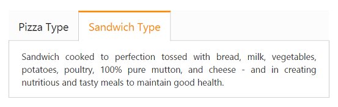

# Keyboard Navigation

Tab control provides supports keyboard interaction. Using this functionality you can interact with control using keyboard. This is achieved by enabling ‘AllowKeyboardNavigation’to ‘true’. By default this property value is set to ‘true’.

Following table illustrates the accessible key and their usage

<table>
<tr>
<th>
Keys</th><th>
Behavior</th></tr>
<tr>
<td>
Up</td><td>
Selected previous item.</td></tr>
<tr>
<td>
Right</td><td>
Selected previous item.</td></tr>
<tr>
<td>
Down</td><td>
Selected next item.</td></tr>
<tr>
<td>
Left</td><td>
Selected next item.</td></tr>
<tr>
<td>
Home</td><td>
Selected first item.</td></tr>
<tr>
<td>
End</td><td>
Selected last item.</td></tr>
</table>
The following code example is used to render the Tab element in RTL format. 

1. Add the following code in your view page to render Tab with keyboard navigation.



	<ej-tab id="dishtab" allow-keyboard-navigation="true">
		<e-tab-items>
			<e-tab-item id="pizzatype" text="Pizza Type">
				<e-content-template>
					

						Pizza cooked to perfection tossed with milk, vegetables, potatoes, poultry, 100% pure mutton, and cheese - and in creating nutritious and tasty meals to maintain good health.
					

				</e-content-template>
			</e-tab-item>
			<e-tab-item id="sandwichtype" text="Sandwich Type">
				<e-content-template>
					

						Sandwich cooked to perfection tossed with bread, milk, vegetables, potatoes, poultry, 100% pure mutton, and cheese - and in creating nutritious and tasty meals to maintain good health.
					

				</e-content-template>
			</e-tab-item>
		</e-tab-items>
	</ej-tab>

// Add the following script to render Tab with keyboard navigation.
	



2. The following screenshot illustrates the Tab with keyboard navigation.

