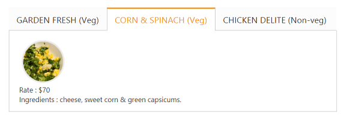

# Template Support

The Content template option provided in ASP.NET Core is used to specify the HTML elements inside the Tab control. We can use this option to load any HTML elements and showcase it in the Tab panels as per our requirement.

The following code block showcases how to use content template option in the Tab control.



	<ej-tab id="tabSample">
		<e-tab-items>
			<e-tab-item id="gardenfresh" text="GARDEN FRESH (Veg)">
				<e-content-template>
					

						
						

							Rate    : $50
							 
							Ingredients : cheese, onions, green capsicums & tomatoes.
						

					

				</e-content-template>
			</e-tab-item>
			<e-tab-item id="cornandspinach" text="CORN & SPINACH (Veg)">
				<e-content-template>
					

						
						

							Rate    : $70
							 
							Ingredients : cheese, sweet corn & green capsicums.
						

					

				</e-content-template>
			</e-tab-item>
			<e-tab-item id="chickendelite" text="CHICKEN DELITE (Non-veg)">
				<e-content-template>
					

						
						

							Rate    : $100
							 
							Ingredients : cheese, chicken chunks, onions & pineapple chunks.
						

					

				</e-content-template>
			</e-tab-item>
		</e-tab-items>
	</ej-tab>



Output:

Tab control with template support
{:.caption}