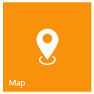
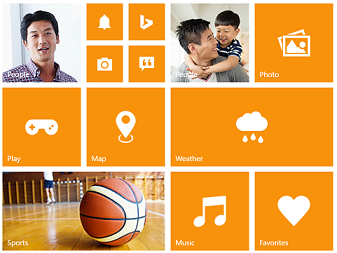

# Getting Started

The Essential Studio for ASP.NET Core Web Tiles are simple, opaque rectangles or squares that are arrayed on the Start screen in a grid-like pattern and it can be either static or live. By Tap or Touch you can navigate to the corresponding linked page/url or whatever function you have configured.
This section explains briefly you how to create a Tile control in your ASP.NET Core application.

## Create a simple Tile

The following steps guide you to add group of Tiles for creating a home page like view that displays all the available applications.

1.	Refer the [Getting Started]( https://help.syncfusion.com/aspnet-core/gettingstarted/getting-started-1-1-0 ) page of the Introduction part to know more about the basic system requirements and the steps to configure the Syncfusion components in an ASP.NET Core application.
2.	To add a Tile control, call Tile helper. You can specify the tile name, size and image URL as follows. Add the following code example to the corresponding view page.

    
            
            <ej-tile id="tile7" tile-size="@TileSize.Medium" image-url="../images/tile/windows/map.png" text="Map"> </ej-tile>
            
    

3.	Run the above code and you will get below output.

In this scenario, a home page is designed using tile for easy navigation. Therefore, you require many different sizes of tiles aligned in a grid-like manner. To align the tiles automatically, define the necessary tile elements inside the wrapper element that contains a **e-tile-column** class. You can define all columns elements under the wrapper element with **e-tile-group** class to make ‘n’ number of tiles as a grouped tile.
Refer the following code example.

 

        

        

            <ej-tile id="tile1" image-position="@TileImagePosition.Fill" tile-size="@TileSize.Medium" image-url="../images/tile/windows/people_1.png" text="People"></ej-tile>
            

                <ej-tile id="tile2" image-position="@TileImagePosition.Center" tile-size="@TileSize.Small" image-url="../images/tile/windows/alerts.png"></ej-tile>
                <ej-tile id="tile3" image-position="@TileImagePosition.Center" tile-size="@TileSize.Small" image-url="../images/tile/windows/bing.png"></ej-tile>
                <ej-tile id="tile4" tile-size="@TileSize.Small" image-url="../images/tile/windows/camera.png"></ej-tile>
                <ej-tile id="tile5" image-position="@TileImagePosition.Center" tile-size="@TileSize.Small" image-url="../images/tile/windows/messages.png"></ej-tile>                
            

            <ej-tile id="tile6" image-position="@TileImagePosition.Center" tile-size="@TileSize.Medium" image-url="../images/tile/windows/games.png" text="Play"></ej-tile>
            <ej-tile id="tile7" tile-size="@TileSize.Medium" image-url="../images/tile/windows/map.png" text="Map"></ej-tile>
            <ej-tile id="tile8" image-position="@TileImagePosition.Fill" tile-size="@TileSize.Wide" image-url="../images/tile/windows/sports.png" text="Sports"></ej-tile>            
        

        

            <ej-tile id="tile9" image-position="@TileImagePosition.Fill" tile-size="@TileSize.Medium" image-url="../images/tile/windows/people_2.png" text="People"></ej-tile>
            <ej-tile id="tile10" image-position="@TileImagePosition.Center" tile-size="@TileSize.Medium" image-url="../images/tile/windows/pictures.png" text="Photo"></ej-tile>
            <ej-tile id="tile11" image-position="@TileImagePosition.Center" tile-size="@TileSize.Wide" image-url="../images/tile/windows/weather.png" text="Weather"></ej-tile>
            <ej-tile id="tile12" image-position="@TileImagePosition.Center" tile-size="@TileSize.Medium" image-url="../images/tile/windows/music.png" text="Music"></ej-tile>
            <ej-tile id="tile13" image-position="@TileImagePosition.Center" tile-size="@TileSize.Medium" image-url="../images/tile/windows/favs.png" text="Favorites"></ej-tile>           
        

     

 

 Now run your application you will get below output.
 
 