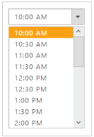

# Range

TimePicker widget provide options to set the Range (MinTime & MaxTime) for the time.

## Steps to change MinTime & MaxTime of the TimePicker

The following steps explains you to change the Range of the TimePicker.

1. Add the following code to the corresponding view page to render the TimePicker.



@*Add the following code example to the corresponding CSHTML page to render TimePicker widget with Min and Max time*@

 <ej-time-picker id="time"  min-time="10:00 AM" max-time="10:00 AM"></ej-time-picker>
 


Execute the above code to render the following output.

Range for TimePicker widget
{:.caption}

