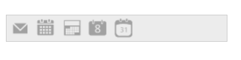

# Behavior settings

The following are some miscellaneous properties that enables you to change the behavior of Toolbar control.

## Enabling Toolbar

Enabled property is Boolean type, which allow us to enable or disable the Toolbar control. By default Enabled value is true. You can specify the property Enabled in the script as follows.



// Add this code in your CSHTML page and refer local data section for data source

<ej-toolbar id="toolbar" width="250px" enabled="false" dataSource="ViewBag.datasource">
    <e-toolbar-fields id="iconid" sprite-css-class="spriteCss">
</ej-toolbar>





        public class ToolbarLocalBinding
        {
            public string iconid { get; set; }
            public string spriteCss { get; set; }
        }
        public IActionResult Index()
        {
            List<ToolbarLocalBinding> t = new List<ToolbarLocalBinding>();

            t.Add(new ToolbarLocalBinding { iconid = "1", spriteCss = "mailtools movetofolder" });
            t.Add(new ToolbarLocalBinding { iconid = "2", spriteCss = "mailtools categorize" });
            t.Add(new ToolbarLocalBinding { iconid = "3", spriteCss = "mailtools flag" });
            t.Add(new ToolbarLocalBinding { iconid = "4", spriteCss = "mailtools forward" });
            t.Add(new ToolbarLocalBinding { iconid = "5", spriteCss = "mailtools newmail" });
            ViewBag.datasource = t;
            return View();
        }







The following screenshot illustrates a Toolbar with Disable mode.

ToolBar control in Enabled (false)
{:.caption}

## Hiding Toolbar 

The Hide property is Boolean type, which allow us to show or hide the Toolbar. Default value of Hide is false. You can specify the property Hide in the script as follows. 

 

// Add this code in your CSHTML page and refer local data section for data source

<ej-toolbar id="toolbar" width="250px" hide="true" dataSource="ViewBag.datasource">
    <e-toolbar-fields id="iconid" sprite-css-class="spriteCss">
</ej-toolbar>



## Disable Or Enable Separate Toolbar Item

The following are some methods which can be used to disable or enable separate toolbar item.

### Disable Item

The **Toolbar** method **disableItem** and **disableItemByID** can be used to disable separate toolbar item. In the below code we have disabled the third toolbar item by using these two methods



      <ej-toolbar id="editingToolbar" create="create">
        <e-toolbar-items>
            <e-toolbar-item sprite-css-class="e-icon e-cut_01" tooltip-text="Cut" />
            <e-toolbar-item sprite-css-class="e-icon e-copy_02" tooltip-text="Copy" />
            <e-toolbar-item sprite-css-class="e-icon e-paste_01" tooltip-text="paste" />
            <e-toolbar-item sprite-css-class="e-icon e-bold_01" tooltip-text="Bold" />
            <e-toolbar-item sprite-css-class="e-icon e-underline_01" tooltip-text="Underline" />
            <e-toolbar-item sprite-css-class="e-icon  e-strikethrough_01" tooltip-text="StrikeThrough" />
            <e-toolbar-item sprite-css-class="e-icon e-align-left_01" tooltip-text="Left" />
            <e-toolbar-item sprite-css-class="e-icon e-align-center_01" tooltip-text="Center" />
            <e-toolbar-item sprite-css-class="e-icon e-align-right_01" tooltip-text="Right" />
            <e-toolbar-item sprite-css-class="e-icon  e-align-justify_01" tooltip-text="Justify" />
        </e-toolbar-items>
    </ej-toolbar> 
    



           function create() {
            var obj = $("#editingToolbar").data("ejToolbar");
            obj.disableItem($(".e-toolbar li")[2]);
        }


OR


       function create() {
            var obj = $("#editingToolbar").data("ejToolbar");
             obj.disableItemByID("paste");
        }
        


### Enable Item

The **Toolbar** method **enableItem** and **enableItemByID** can be used to enable separate toolbar item. In the below code we have disbaled the first five items initially and enabled the third toolbar item by using these two methods


      @{
           List<int> index = new List<int> { 0,1,2,3,4 };
       }
	 <ej-toolbar id="editingToolbar" create="create"  disabled-item-indices="index">
        <e-toolbar-items>
            <e-toolbar-item sprite-css-class="e-icon e-cut_01" tooltip-text="Cut" />
            <e-toolbar-item sprite-css-class="e-icon e-copy_02" tooltip-text="Copy" />
            <e-toolbar-item sprite-css-class="e-icon e-paste_01" tooltip-text="paste" />
            <e-toolbar-item sprite-css-class="e-icon e-bold_01" tooltip-text="Bold" />
            <e-toolbar-item sprite-css-class="e-icon e-underline_01" tooltip-text="Underline" />
            <e-toolbar-item sprite-css-class="e-icon  e-strikethrough_01" tooltip-text="StrikeThrough" />
            <e-toolbar-item sprite-css-class="e-icon e-align-left_01" tooltip-text="Left" />
            <e-toolbar-item sprite-css-class="e-icon e-align-center_01" tooltip-text="Center" />
            <e-toolbar-item sprite-css-class="e-icon e-align-right_01" tooltip-text="Right" />
            <e-toolbar-item sprite-css-class="e-icon  e-align-justify_01" tooltip-text="Justify" />
        </e-toolbar-items>
    </ej-toolbar> 
    



           function create() {
            var obj = $("#editingToolbar").data("ejToolbar");
            obj.enableItem($(".e-toolbar li")[2]);
        }


OR


       function create() {
            var obj = $("#editingToolbar").data("ejToolbar");
             obj.enableItemByID("paste");
        }
        


