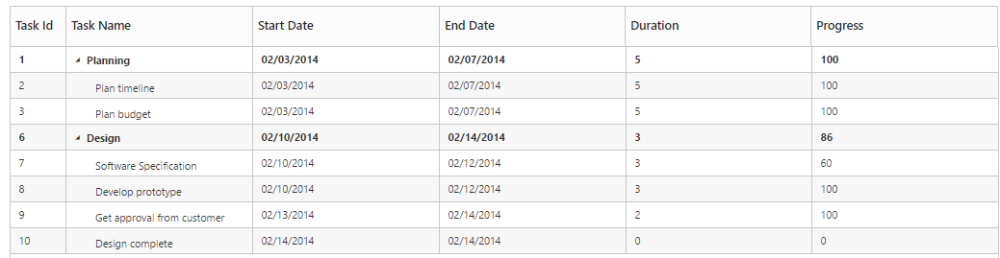
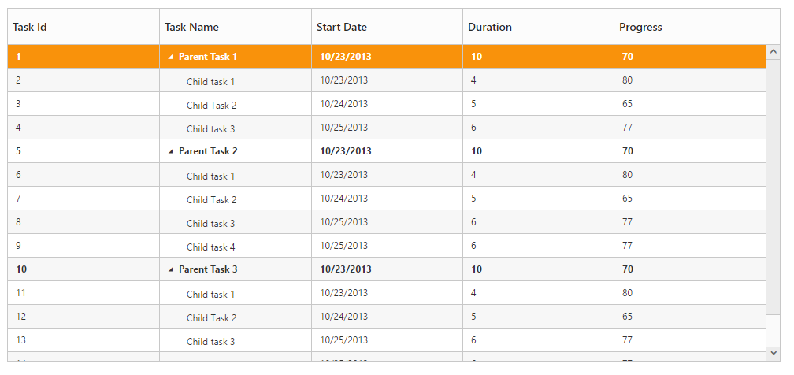

# Data Binding

Data Binding is the process that establishes a connection between the application and different kinds of data sources such as business objects.

## Local Data Binding

In Local Data Binding, datasource for rendering the TreeGrid control is retrieved from the same application locally.

Two types of Data Binding are possible with TreeGrid control, 

* Hierarchical Datasource Binding
* Self-Referential Data Binding (Flat Data)

## Hierarchy Datasource Binding

The following code example shows you how to bind the Hierarchical local data into the TreeGrid control.





 public partial class TreeGridController : Controller
    {
        //
        // GET: /Default/

        public ActionResult Default()
        {
            var data = this.GetDefaultData();
            ViewBag.datasource = data;
            return View();
        }

        private List<BusinessObject> GetDefaultData()
        {
            List<BusinessObject> BusinessObjectCollection = new List<BusinessObject>();

            BusinessObject Record1 = null;

            Record1 = new BusinessObject()
            {
                TaskId = 1,
                TaskName = "Planning",
                StartDate = "02/03/2014",
                EndDate = "02/07/2014",
                Progress = 100,
                Duration = 5,
                Children = new List<BusinessObject>(),
            };

            BusinessObject Child1 = new BusinessObject()
            {
                TaskId = 2,
                TaskName = "Plan timeline",
                StartDate = "02/03/2014",
                EndDate = "02/07/2014",
                Duration = 5,
                Progress = 100
            };

            BusinessObject Child2 = new BusinessObject()
            {
                TaskId = 3,
                TaskName = "Plan budget",
                StartDate = "02/03/2014",
                EndDate = "02/07/2014",
                Duration = 5,
                Progress = 100
            };

            BusinessObject Child3 = new BusinessObject()
            {
                TaskId = 4,
                TaskName = "Allocate resources",
                StartDate = "02/03/2014",
                EndDate = "02/07/2014",
                Duration = 5,
                Progress = 100
            };

            BusinessObject Child4 = new BusinessObject()
            {
                TaskId = 5,
                TaskName = "Planning complete",
                StartDate = "02/07/2014",
                EndDate = "02/07/2014",
                Duration = 0,
                Progress = 0
            };

            Record1.Children.Add(Child1);
            Record1.Children.Add(Child2);
            BusinessObject Record2 = new BusinessObject()
            {
                TaskId = 6,
                TaskName = "Design",
                StartDate = "02/10/2014",
                EndDate = "02/14/2014",
                Progress = 86,
                Duration = 3,
                Children = new List<BusinessObject>(),
            };

            BusinessObject Child5 = new BusinessObject()
            {
                TaskId = 7,
                TaskName = "Software Specification",
                StartDate = "02/10/2014",
                EndDate = "02/12/2014",
                Duration = 3,
                Progress = 60
            };

            BusinessObject Child6 = new BusinessObject()
            {
                TaskId = 8,
                TaskName = "Develop prototype",
                StartDate = "02/10/2014",
                EndDate = "02/12/2014",
                Duration = 3,
                Progress = 100
            };

            BusinessObject Child7 = new BusinessObject()
            {
                TaskId = 9,
                TaskName = "Get approval from customer",
                StartDate = "02/13/2014",
                EndDate = "02/14/2014",
                Duration = 2,
                Progress = 100
            };

            BusinessObject Child8 = new BusinessObject()
            {
                TaskId = 10,
                TaskName = "Design complete",
                StartDate = "02/14/2014",
                EndDate = "02/14/2014",
                Duration = 0,
                Progress = 0
            };

            Record2.Children.Add(Child5);
            Record2.Children.Add(Child6);
            Record2.Children.Add(Child7);
            Record2.Children.Add(Child8);
            BusinessObjectCollection.Add(Record1);
            BusinessObjectCollection.Add(Record2);
            return BusinessObjectCollection;
        }

        public class BusinessObject
        {
            public int TaskId
            {
                get;
                set;
            }

            public string TaskName
            {
                get;
                set;
            }

            public string StartDate
            {
                get;
                set;
            }

            public string EndDate
            {
                get;
                set;
            }

            public int Duration
            {
                get;
                set;
            }

            public int Progress
            {
                get;
                set;
            }
            public string Priority
            {
                get;
                set;
            }
            public bool InProgress
            {
                get;
                set;
            }
            public DateTime FilterStartDate
            {
                get;
                set;
            }
            public DateTime FilterEndDate
            {
                get;
                set;
            }
            public List<BusinessObject> Children
            {
                get;
                set;
            }

        }
    }




@using Syncfusion.JavaScript

@using Syncfusion.JavaScript.Models

@using Syncfusion.MVC.EJ 

<!DOCTYPE html>     

<html>

<head>

         @*Add script reference and style reference here*@

</head>

<body>

  <ej-tree-grid id="TreeGridContainer" datasource="ViewBag.datasource" child-mapping="Children" tree-column-index="1">
        <e-tree-grid-columns>
            <e-tree-grid-column field="TaskId" header-text="Task Id" width=45 />
            <e-tree-grid-column field="TaskName" header-text="Task Name" />
            <e-tree-grid-column field="StartDate" header-text="Start Date" />
            <e-tree-grid-column field="EndDate" header-text="End Date" />
            <e-tree-grid-column field="Duration" header-text="Duration" />
            <e-tree-grid-column field="Progress" header-text="Progress" />
        </e-tree-grid-columns>
    </ej-tree-grid>                           

      

</body>

</html>


  

The output of the above steps is as follows:

## Self-Referential Data Binding (Flat Data)

TreeGrid is rendered from Self-Referential data structures by providing two fields: ID field and parent ID field.

•ID Field- This field contains unique values used to identify nodes. Its name is assigned to the id-mapping property.

•Parent ID Field- This field contains values that indicate parent nodes. Its name is assigned to the parent-id-mapping property.





    public partial class TreeGridController : Controller
    {

        public ActionResult Default()
        {
            var data = this.GetDefaultData();
            ViewBag.datasource = data;
            return View();
        }

        #region Create DataSource for Self TreeGrid control
        private List<BusinessObject> GetDefaultData()
        {
            List<BusinessObject> BusinessObjectCollection = new List<BusinessObject>();
            BusinessObjectCollection.Add(new BusinessObject()
            {
                TaskId = 1,
                TaskName = "Parent Task 1",
                StartDate = "10/23/2013",
                Duration = 10,
                Progress = 70,
                ParentId = 1
            });
            BusinessObjectCollection.Add(new BusinessObject()
            {
                TaskId = 2,
                TaskName = "Child task 1",
                StartDate = "10/23/2013",
                Duration = 4,
                Progress = 80,
                ParentId = 1
            });
            BusinessObjectCollection.Add(new BusinessObject()
            {
                TaskId = 3,
                TaskName = "Child Task 2",
                StartDate = "10/24/2013",
                Duration = 5,
                Progress = 65,
                ParentId = 1
            });
            BusinessObjectCollection.Add(new BusinessObject()
            {
                TaskId = 4,
                TaskName = "Child task 3",
                StartDate = "10/25/2013",
                Duration = 6,
                Progress = 77,
                ParentId = 1
            });
            BusinessObjectCollection.Add(new BusinessObject()
            {
                TaskId = 5,
                TaskName = "Parent Task 2",
                StartDate = "10/23/2013",
                Duration = 10,
                Progress = 70,
                ParentId = 1
            });
            BusinessObjectCollection.Add(new BusinessObject()
            {
                TaskId = 6,
                TaskName = "Child task 1",
                StartDate = "10/23/2013",
                Duration = 4,
                Progress = 80,
                ParentId = 5
            });
            BusinessObjectCollection.Add(new BusinessObject()
            {
                TaskId = 7,
                TaskName = "Child Task 2",
                StartDate = "10/24/2013",
                Duration = 5,
                Progress = 65,
                ParentId = 5
            });
            BusinessObjectCollection.Add(new BusinessObject()
            {
                TaskId = 8,
                TaskName = "Child task 3",
                StartDate = "10/25/2013",
                Duration = 6,
                Progress = 77,
                ParentId = 5
            });
            BusinessObjectCollection.Add(new BusinessObject()
            {
                TaskId = 9,
                TaskName = "Child task 4",
                StartDate = "10/25/2013",
                Duration = 6,
                Progress = 77,
                ParentId = 5
            });
            BusinessObjectCollection.Add(new BusinessObject()
            {
                TaskId = 10,
                TaskName = "Parent Task 3",
                StartDate = "10/23/2013",
                Duration = 10,
                Progress = 70,
                ParentId = 5
            });
            BusinessObjectCollection.Add(new BusinessObject()
            {
                TaskId = 11,
                TaskName = "Child task 1",
                StartDate = "10/23/2013",
                Duration = 4,
                Progress = 80,
                ParentId = 10
            });
            BusinessObjectCollection.Add(new BusinessObject()
            {
                TaskId = 12,
                TaskName = "Child Task 2",
                StartDate = "10/24/2013",
                Duration = 5,
                Progress = 65,
                ParentId = 10
            });
            BusinessObjectCollection.Add(new BusinessObject()
            {
                TaskId = 13,
                TaskName = "Child task 3",
                StartDate = "10/25/2013",
                Duration = 6,
                Progress = 77,
                ParentId = 10
            });
            BusinessObjectCollection.Add(new BusinessObject()
            {
                TaskId = 14,
                TaskName = "Child task 4",
                StartDate = "10/25/2013",
                Duration = 6,
                Progress = 77,
                ParentId = 10
            });
            BusinessObjectCollection.Add(new BusinessObject()
            {
                TaskId = 15,
                TaskName = "Child task 5",
                StartDate = "10/25/2013",
                Duration = 6,
                Progress = 77,
                ParentId = 10
            });

            return BusinessObjectCollection;
        }
        #endregion

    }




<ej-tree-grid id="TreeGridContainer" datasource="ViewBag.datasource" tree-column-index="1" allow-column-resize="true" is-responsive="true" id-mapping="Id" parent-id-mapping="ParentId">
    <e-tree-grid-columns>
        <e-tree-grid-column field="TaskId" header-text="Task Id" width=45 />
        <e-tree-grid-column field="TaskName" header-text="Task Name" />
        <e-tree-grid-column field="StartDate" header-text="Start Date" />   
        <e-tree-grid-column field="Duration" header-text="Duration" />
        <e-tree-grid-column field="Progress" header-text="Progress" />
    </e-tree-grid-columns>
</ej-tree-grid> 


  

The following screenshot shows the output of the above steps,

