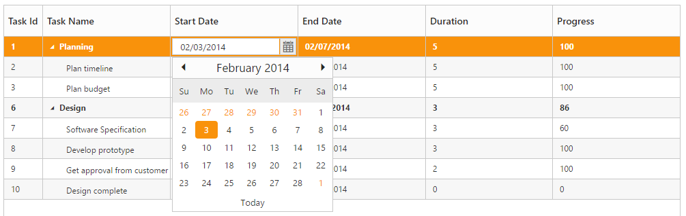

# Editing

The TreeGrid control provides built-in support for Editing cell items. 

## Cell Editing

Update the task details through grid Cell Editing by setting EditMode as CellEditing.

The following code example shows you how to enable CellEditing in TreeGrid control.



<ej-tree-grid id="TreeGridContainer" datasource="ViewBag.datasource" child-mapping="Children" tree-column-index="1">
    <e-tree-grid-edit-settings allow-editing="true" edit-mode="@TreeGridEditMode.CellEditing"></e-tree-grid-edit-settings>
    <e-tree-grid-columns>
        <e-tree-grid-column field="TaskId" header-text="Task Id" width=45 edit-type="Numeric" />
        <e-tree-grid-column field="TaskName" header-text="Task Name" edit-type="String" />
        <e-tree-grid-column field="StartDate" header-text="Start Date" edit-type="Datepicker" />
        <e-tree-grid-column field="EndDate" header-text="End Date" edit-type="Datepicker" />
        <e-tree-grid-column field="Duration" header-text="Duration" edit-type="Numeric" />
        <e-tree-grid-column field="Progress" header-text="Progress" edit-type="Numeric" />
    </e-tree-grid-columns>
</ej-tree-grid>  



The output of TreeGrid with CellEditing is as follows.

