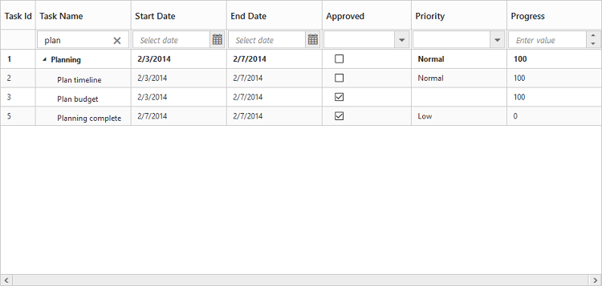

# Filtering

Filtering helps to view specific or related records from data source which meets a given filtering criteria. To enable filtering in TreeGrid, set `AllowFiltering` as `true`
TreeGrid provides support for the following filtering modes,

* Filter bar
* Menu

Also, the following filtering types are available in TreeGrid

* String
* Boolean
* Date
* Numeric
* Dropdown

The below code explains how to enable filtering in TreeGrid.



<ej-tree-grid id="TreeGridControlFiltering" allow-filtering="true">
  //...
</ej-tree-grid>



The output of the TreeGrid with filtering enabled is as follows.

## Filtering Modes

### Filter Bar 

This is the default filtering mode in TreeGrid. It can also be enabled by setting `FilterSettings.FilterType` as `FilterBar`. When this filtering mode is enabled, a filter row will be displayed below the column header, in which we can provide the filter query.

There are two types of actions available to initiate the filtering process in the filter bar mode,

`immediate`- Filtering action will be initiated immediately on key press, for each character being typed in the filter bar.
`onEnter` – Filtering action will be initiated only on enter key press in the filter bar.

The below code snippet explains the above behavior,


 
<ej-tree-grid id="TreeGridControlFiltering" allow-filtering="true">         
    //...
    <e-tree-grid-filter-settings filter-type="FilterBar"></e-tree-grid-filter-settings>
</ej-tree-grid>



The output of the filtering with filter bar enabled is as follows.

### Menu filtering
Menu filtering can be enabled by setting `FilterSettings.FilterType` property as `Menu`. The below code snippet explains how to enable menu filtering in TreeGrid



<ej-tree-grid id="TreeGridControlFiltering" allow-filtering="true">         
    //...
    <e-tree-grid-filter-settings filter-type="Menu"></e-tree-grid-filter-settings>
</ej-tree-grid>



The output of the filtering with filter menu enabled is as follows.

## Filtering types
By default, the filtering type for a column is inherited from the `Columns.EditType` property. You can also define a specific filtering type for a column using `Columns.FilterEditType` property.
The below code snippet explains on how to set a filtering type for a column.



<ej-tree-grid id="TreeGridControlFiltering" allow-filtering="true">
    <e-tree-grid-columns>
        <e-tree-grid-column field="TaskID" edit-type="Numeric" allow-filtering="false" />
        <e-tree-grid-column field="TaskName" edit-type="String" filter-edit-type="String" />
        <e-tree-grid-column field="FilterStartDate" edit-type="Datepicker" filter-edit-type="Datepicker"/>
        <e-tree-grid-column field="FilterEndDate" edit-type="Datepicker" filter-edit-type="Datepicker"/>
        <e-tree-grid-column field="Priority" edit-type="Dropdown" filter-edit-type="Dropdown" />
        <e-tree-grid-column field="Progress" edit-type="Numeric" filter-edit-type="Numeric" />                
     </e-tree-grid-columns>
     <e-tree-grid-filter-settings filter-type="FilterBar"></e-tree-grid-filter-settings>
</ej-tree-grid>



## Filter columns at initial load
It is also possible to filter one or more columns at load time by providing the field and filter query values to the `FilterSettings.FilteredColumns` property. The following code example explains how to filter a column on initial load.



 <ej-tree-grid id="TreeGridControlFiltering" allow-filtering="true">        
     <e-tree-grid-filter-settings filter-type="FilterBar">
      <e-tree-grid-filtered-columns>
       <e-tree-grid-filtered-column field="TaskName" operator="StartsWith" value="plan"/>
      </e-tree-grid-filtered-columns>
     </e-tree-grid-filter-settings>           
</ej-tree-grid>



## Disabling filtering for a specific column 
It is possible to disable filtering for a specific column by setting `Columns.AllowFiltering` as `false` in the column definition.
The below code snippet explains the above behavior


<ej-tree-grid id="TreeGridControlFiltering" allow-filtering="true">
    <e-tree-grid-columns>
        <e-tree-grid-column field="TaskID" allow-filtering="false" />            
     </e-tree-grid-columns>
     //...
</ej-tree-grid>



The output of the filtering enabled for only one column is as follows.

