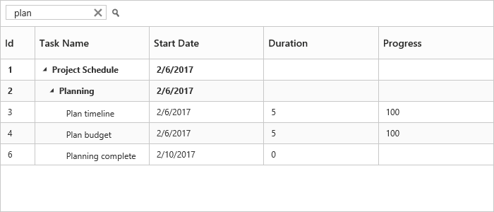

## Searching

The TreeGrid control has an option to search its content using toolbar search box. The toolbar search box can be enabled by using the `ToolbarSettings.ToolbarItems` property. The following code example explains how to integrate search textbox in toolbar.



<ej-tree-grid id="TreeGridContainer">
    <e-tree-grid-toolbar-settings show-toolbar="true" toolbar-items="ViewBag.toolbarItems">
    </e-tree-grid-toolbar-settings>
</ej-tree-grid>





public partial class TreeGridController : Controller
{
    public ActionResult Default()
    {
        ViewBag.toolbarItems = new List<String>() { "search" };
        return View();
    }
}



The below screenshot shows TreeGrid search with `plan` key word.
