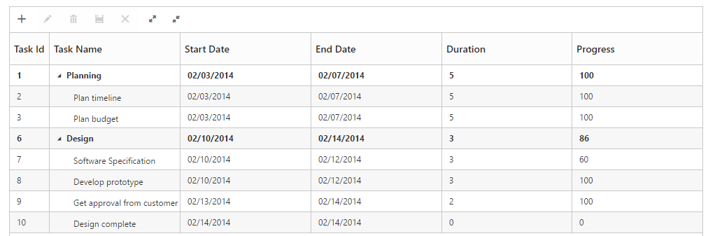

# Toolbar

TreeGrid control contains toolbar options for adding, deleting and editing the records. You can customize the TreeGridToolbar tools by using toolbar-settings API. 

In TreeGrid by using row-position API, the index position for the newly added row can be provided. Default value of the row-position property is top. The Enum values for row-position API are,

* top
* bottom
* aboveSelectedRow
* belowSelectedRow

You can enable toolbar for TreeGrid, using the following code example.




  public partial class TreeGridController : Controller
    {
        //
        // GET: /Default/

        public ActionResult Default()
        {
            var data = this.GetDefaultData();
            ViewBag.datasource = data;
            ViewBag.toolbarItems = new List<String>() { "add", "edit", "delete", "update", "cancel", "expandAll", "collapseAll" };
            return View();
        }

        private List<BusinessObject> GetDefaultData()
        {
            List<BusinessObject> BusinessObjectCollection = new List<BusinessObject>();

            BusinessObject Record1 = null;

            Record1 = new BusinessObject()
            {
                TaskId = 1,
                TaskName = "Planning",
                StartDate = "02/03/2014",
                EndDate = "02/07/2014",
                Progress = 100,
                Duration = 5,
                Children = new List<BusinessObject>(),
            };

            BusinessObject Child1 = new BusinessObject()
            {
                TaskId = 2,
                TaskName = "Plan timeline",
                StartDate = "02/03/2014",
                EndDate = "02/07/2014",
                Duration = 5,
                Progress = 100
            };

            BusinessObject Child2 = new BusinessObject()
            {
                TaskId = 3,
                TaskName = "Plan budget",
                StartDate = "02/03/2014",
                EndDate = "02/07/2014",
                Duration = 5,
                Progress = 100
            };

            BusinessObject Child3 = new BusinessObject()
            {
                TaskId = 4,
                TaskName = "Allocate resources",
                StartDate = "02/03/2014",
                EndDate = "02/07/2014",
                Duration = 5,
                Progress = 100
            };

            BusinessObject Child4 = new BusinessObject()
            {
                TaskId = 5,
                TaskName = "Planning complete",
                StartDate = "02/07/2014",
                EndDate = "02/07/2014",
                Duration = 0,
                Progress = 0
            };

            Record1.Children.Add(Child1);
            Record1.Children.Add(Child2);
            BusinessObject Record2 = new BusinessObject()
            {
                TaskId = 6,
                TaskName = "Design",
                StartDate = "02/10/2014",
                EndDate = "02/14/2014",
                Progress = 86,
                Duration = 3,
                Children = new List<BusinessObject>(),
            };

            BusinessObject Child5 = new BusinessObject()
            {
                TaskId = 7,
                TaskName = "Software Specification",
                StartDate = "02/10/2014",
                EndDate = "02/12/2014",
                Duration = 3,
                Progress = 60
            };

            BusinessObject Child6 = new BusinessObject()
            {
                TaskId = 8,
                TaskName = "Develop prototype",
                StartDate = "02/10/2014",
                EndDate = "02/12/2014",
                Duration = 3,
                Progress = 100
            };

            BusinessObject Child7 = new BusinessObject()
            {
                TaskId = 9,
                TaskName = "Get approval from customer",
                StartDate = "02/13/2014",
                EndDate = "02/14/2014",
                Duration = 2,
                Progress = 100
            };

            BusinessObject Child8 = new BusinessObject()
            {
                TaskId = 10,
                TaskName = "Design complete",
                StartDate = "02/14/2014",
                EndDate = "02/14/2014",
                Duration = 0,
                Progress = 0
            };

            Record2.Children.Add(Child5);
            Record2.Children.Add(Child6);
            Record2.Children.Add(Child7);
            Record2.Children.Add(Child8);
            BusinessObjectCollection.Add(Record1);
            BusinessObjectCollection.Add(Record2);
            return BusinessObjectCollection;
        }

        public class BusinessObject
        {
            public int TaskId
            {
                get;
                set;
            }

            public string TaskName
            {
                get;
                set;
            }

            public string StartDate
            {
                get;
                set;
            }

            public string EndDate
            {
                get;
                set;
            }

            public int Duration
            {
                get;
                set;
            }

            public int Progress
            {
                get;
                set;
            }
            public string Priority
            {
                get;
                set;
            }
            public bool InProgress
            {
                get;
                set;
            }
            public DateTime FilterStartDate
            {
                get;
                set;
            }
            public DateTime FilterEndDate
            {
                get;
                set;
            }
            public List<BusinessObject> Children
            {
                get;
                set;
            }

        }
    }





<ej-tree-grid id="TreeGridContainer" datasource="ViewBag.datasource" child-mapping="Children" tree-column-index="1">
    <e-tree-grid-edit-settings allow-editing="true" row-position="AboveSelectedRow"></e-tree-grid-edit-settings>
    <e-tree-grid-toolbar-settings show-toolbar="true" toolbar-items="ViewBag.toolbarItems" >
    </e-tree-grid-toolbar-settings>
    <e-tree-grid-columns>
        <e-tree-grid-column field="TaskId" header-text="Task Id" width=45 edit-type="Numeric" />
        <e-tree-grid-column field="TaskName" header-text="Task Name" edit-type="String" />
        <e-tree-grid-column field="StartDate" header-text="Start Date" edit-type="Datepicker" />
        <e-tree-grid-column field="EndDate" header-text="End Date" edit-type="Datepicker" />
        <e-tree-grid-column field="Duration" header-text="Duration" edit-type="Numeric" />
        <e-tree-grid-column field="Progress" header-text="Progress" edit-type="Numeric" />
    </e-tree-grid-columns>
</ej-tree-grid>   


  

The following screenshot displays the toolbar option in TreeGrid control

