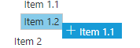
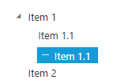
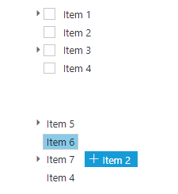

# Drag and Drop

To perform drag and drop operation in TreeView specify **AllowDragAndDrop** as true. It allows you to drag and drop node in all level of same TreeView.
    
    
    
      <ej-tree-view id="treeView" allow-drag-and-drop="true"><e-tree-view-fields datasource="ViewBag.datasource" id="Id" parent-id="Parent" text="Text"></e-tree-view-fields></ej-tree-view>
   
    

N>**TreeView provides much easier option to drop the dragged nodes at any levels by indicator lines with icons.**

## Position Indicators

TreeView provides much easier option to drop the dragged nodes at any levels by indicator lines with icons such as line, plus/ minus and restrict icons while dragging and dropping the nodes. It represents exact position where the node to be dropped as sibling or child.

<table>
<tr>
<td>
    {{'**Indicators**'| markdownify }}
</td>
<td>
    {{'**description**'| markdownify }}
</td>
</tr>
<tr>
<td>
Plus icon
</td>
<td>
represents the dragged node to be added as child of targeted node
</td>
</tr>
<tr>
<td>
Minus with restrict icon
</td>
<td>
represents the dragged node not to be dropped at the hovered region
</td>
</tr>
<tr>
<td>
In between icon
</td>
<td>
represents the dragged node to be dropped in between the nodes as siblings
</td>
</tr>
</table>

While dragged node to be added as child of targeted node,it will look like below.
 

While dragged node not to be dropped at the hovered region, it will look like below.

While dragged node to be dropped in between the nodes as siblings, it will look like below.

## Restriction

You can restrict the dragged nodes to be dropped at siblings or children’s level by using **AllowDropSibling** and **AllowDropChild** properties.
  
    
    
      <ej-tree-view id="treeView" allow-drag-and-drop="true" allow-drop-sibling="true" allow-drop-child="false"><e-tree-view-fields datasource="ViewBag.datasource" id="Id" parent-id="Parent" text="Text"></e-tree-view-fields></ej-tree-view>

    
    
## Drag and drop between Trees

You can drag and drop tree nodes between two TreeView by setting **AllowDragAndDrop** as true along with **AllowDragAndDropAcrossControl** as true.

In the controller page, create a data list that contains the details about tree nodes.
    
    
    
    public partial class TreeViewController : Controller
        {
            List<LoadData> tree1 = new List<LoadData>();
            List<LoadData> tree2 = new List<LoadData>();
            public ActionResult TreeViewFeatures()
            {
                tree1.Add(new LoadData { Id = 1, Parent = 0, Text = "Item 1" });
                tree1.Add(new LoadData { Id = 2, Parent = 0, Text = "Item 2" });
                tree1.Add(new LoadData { Id = 3, Parent = 0, Text = "Item 3" });
                tree1.Add(new LoadData { Id = 4, Parent = 0, Text = "Item 4" });
                tree1.Add(new LoadData { Id = 5, Parent = 1, Text = "Item 1.1" });
                tree1.Add(new LoadData { Id = 6, Parent = 1, Text = "Item 1.2" });
                tree1.Add(new LoadData { Id = 7, Parent = 1, Text = "Item 1.3" });
                tree1.Add(new LoadData { Id = 8, Parent = 3, Text = "Item 3.1" });
                tree1.Add(new LoadData { Id = 9, Parent = 3, Text = "Item 3.2" });
                tree1.Add(new LoadData { Id = 10, Parent = 5, Text = "Item 1.1.1" });
                ViewBag.datasource1 = tree1;
    
                tree2.Add(new LoadData { Id = 11, Parent = 0, Text = "Item 5" });
                tree2.Add(new LoadData { Id = 12, Parent = 0, Text = "Item 6" });
                tree2.Add(new LoadData { Id = 13, Parent = 0, Text = "Item 7" });
                tree2.Add(new LoadData { Id = 14, Parent = 0, Text = "Item 4" });
                tree2.Add(new LoadData { Id = 15, Parent = 11, Text = "Item 5.1" });
                tree2.Add(new LoadData { Id = 16, Parent = 11, Text = "Item 5.2" });
                tree2.Add(new LoadData { Id = 17, Parent = 11, Text = "Item 5.3" });
                tree2.Add(new LoadData { Id = 18, Parent = 13, Text = "Item 7.1" });
                tree2.Add(new LoadData { Id = 19, Parent = 13, Text = "Item 7.2" });
                tree2.Add(new LoadData { Id = 10, Parent = 15, Text = "Item 5.1.1" });
                ViewBag.datasource2 = tree2;
                return View();
            }
        }
        
           
    
In the view page, add the below code and map the properties defined in to the corresponding fields in data source and specify the drag and drop settings.
        
    
    
      <ej-tree-view id="treeview1" show-checkbox="true" allow-drag-and-drop="true" allow-drop-sibling="true" allow-drop-child="true" allow-drag-and-drop-across-control="true"><e-tree-view-fields datasource="ViewBag.datasource1" id="Id" parent-id="Parent" text="Text"></e-tree-view-fields></ej-tree-view>
    
      <ej-tree-view id="treeview2" allow-drag-and-drop="true" allow-drop-sibling="true" allow-drop-child="true" allow-drag-and-drop-across-control="true"><e-tree-view-fields datasource="ViewBag.datasource2" id="Id" parent-id="Parent" text="Text"></e-tree-view-fields></ej-tree-view>

    

## Auto node structuring

You may not need to have two TreeView to be in same structured node while drag and drop the nodes between them. But after the node has been dropped, it should get structure of the TreeView node in which dropped. By default TreeView auto structure the node whenever you drop a node from different tree.      
    
    
         
      <ej-tree-view id="treeview1" allow-drag-and-drop="true" allow-drop-sibling="true" allow-drop-child="true" allow-drag-and-drop-across-control="true"><e-tree-view-fields datasource="ViewBag.datasource1" id="Id" parent-id="Parent" text="Text"></e-tree-view-fields></ej-tree-view>
    
      <ej-tree-view id="treeview2" allow-drag-and-drop="true" allow-drop-sibling="true" allow-drop-child="true" allow-drag-and-drop-across-control="true"><e-tree-view-fields datasource="ViewBag.datasource2" id="Id" parent-id="Parent" text="Text"></e-tree-view-fields></ej-tree-view>
    
        
    
N>**Auto node structure only applicable for well-structured node object.**