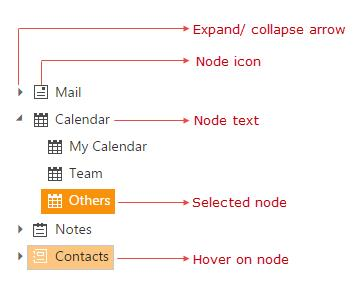

# Tree Node

TreeView node is structured with expand/ collapse arrow, checkbox, image and text as shown in below.

Also TreeView node object holds the following properties.

<table>
<tr>
<td>
    {{'**Properties**'| markdownify }}
</td>
<td>
    {{'**Data Type**'| markdownify }}
</td>
<td>
    {{'**Description**'| markdownify }}
</td>
</tr>
<tr>
<td>
    checked 
</td>
<td>
    Boolean
</td>
<td>
    Checked state of the node
</td>
</tr>
<tr>
<td>
    count
</td>
<td>
    Number
</td>
<td>
    Number of child
</td>
</tr>
<tr>
<td>
    expanded
</td>
<td>
    Boolean
</td>
<td>
    Expanded state of the node
</td>
</tr>
<tr>
<td>
    index
</td>
<td>
    Number
</td>
<td>
    Index of the node 
</td>
</tr>
<tr>
<td>
    level
</td>
<td>
    Number
</td>
<td>
    Level of the node
</td>
</tr>
<tr>
<td>
    id
</td>
<td>
    String
</td>
<td>
    Node id
</td>
</tr>
<tr>
<td>
    parentId
</td>
<td>
    String
</td>
<td>
    Parent id of the node
</td>
</tr>
<tr>
<td>
    selected
</td>
<td>
    Boolean
</td>
<td>
    Selected state of the node
</td>
</tr>
</table>

## Get / Set Node Value

TreeView provides a set of options to configure all its properties by setting and getting values at initialization or dynamically. 

To get the node value, you can use [getNode](http://help.syncfusion.com/js/api/ejtreeview#methods:getnode) method as shown in the below code example, in which on button click action the node value has retrieved.

In the controller page, create a data list that contains the details about tree nodes.
    
        
    
    
        public partial class TreeViewController : Controller
        {
            List<LoadData> load = new List<LoadData>();
            public ActionResult TreeViewFeatures()
            {
                load.Add(new LoadData { Id = 1, Parent = 0, Text = "Item 1" });
                load.Add(new LoadData { Id = 2, Parent = 0, Text = "Item 2" });
                load.Add(new LoadData { Id = 3, Parent = 0, Text = "Item 3" });
                load.Add(new LoadData { Id = 4, Parent = 1, Text = "Item 1.1" });
                load.Add(new LoadData { Id = 5, Parent = 1, Text = "Item 1.2" });
                load.Add(new LoadData { Id = 6, Parent = 3, Text = "Item 3.1" });
                ViewBag.datasource = load;
                return View();
            }
        }
    
    
    
    
    
In the view page, add the below code and map the properties defined in to the corresponding fields in data source.
     
    
    
      <ej-tree-view id="treeView"><e-tree-view-fields datasource="ViewBag.datasource" id="Id" parent-id="Parent" text="Text"></e-tree-view-fields></ej-tree-view>

      
    
    
In the view page, specify following method in script tag to get node value
    
    
    
    
    
    
    
N>**Existing TreeView instance can be created by [jQuery.data()](http://api.jquery.com/jQuery.data/#) and you can control the API’s of TreeView behavior**.

To edit the node text, you can use [updateText](http://help.syncfusion.com/js/api/ejtreeview#methods:updatetext) method as shown below code example. 
        
    
    
    
    
    
    
    
## Get Parent Node

To get current parent node of a particular node, you can use the [getParent](http://help.syncfusion.com/js/api/ejtreeview#methods:getparent) method as shown in below code example 
    
    
    
    
    
    
    
    
## Get Node Index

To get node index, you can use the [getNodeIndex](http://help.syncfusion.com/js/api/ejtreeview#methods:getnodeindex) as shown in below code example 
           
    
    
    
    
        
    
## Node Manipulations

You can perform following operation in tree nodes and the modified node values can be saved in database.

### Add or Remove nodes

To add/remove nodes programmatically, use [addNode](http://help.syncfusion.com/js/api/ejtreeview#methods:addnode) and [removeNode](http://help.syncfusion.com/js/api/ejtreeview#methods:removenode) methods of the TreeView.

    
    
        //create an instance from an existing TreeView.
        // only after control creation you can get treeObj otherwise it throws exception.
        treeObj = $("#treeView").ejTreeView('instance');
        var newNode = { Id: 11, Text: "Item 2.1" };
        //to add tree node
        treeObj.addNode(newNode, "2");
        
        //to remove node
        treeObj.removeNode("4");
    
    

You can able to add a new node after or before some TreeView node by using [insertAfter](http://help.syncfusion.com/js/api/ejtreeview#methods:insertafter) and [insertBefore](http://help.syncfusion.com/js/api/ejtreeview#methods:insertbefore) methods.

    
    
        //create an instance from an existing TreeView.
        // only after control creation you can get treeObj otherwise it throws exception.
        treeObj = $("#treeView").ejTreeView('instance');
        var newNode = { Id: 12, Text: "Item 2.2" };

        //to add tree node after some element, which having id 2
        treeObj.{{'**insertAfter(newNode, "2");**'| markdownify }}
    
        var newNode = { Id: 13, Text: "Item 2.3" };
        //to add tree node before some element, which having id 2
        treeObj.{{'**insertBefore(newNode, "2");**'| markdownify }}
        
    

### Move node

You can also achieve cut and paste operation by using [moveNode](http://help.syncfusion.com/js/api/ejtreeview#methods:movenode) method.

    
    
        //create an instance from an existing TreeView.
        // only after control creation you can get treeObj otherwise it throws exception.
        treeObj = $("#treeView").ejTreeView('instance');
        
        //to move tree node which having id 5, to child of node which having id 2.   
        treeObj.moveNode("5", "2");
            
    

### Expand or Collapse node

Tree nodes can be expanded or collapsed by clicking the expand/collapse icon of the node or in code behind by using the following methods.

<table>
<tr>
<td>
    {{'**Methods**'| markdownify }}
</td>
<td>
    {{'**Description**'| markdownify }}
</td>
</tr>
<tr>
<td>
    {{'[expandNode](http://help.syncfusion.com/js/api/ejtreeview#methods:expandnode)'| markdownify }}
</td>
<td>
Expands the node with specified id
</td>
</tr>
<tr>
<td>
    {{'[collapseNode](http://help.syncfusion.com/js/api/ejtreeview#methods:collapsenode)'| markdownify }}
</td>
<td>
Collapse the node with specified id
</td>
</tr>
<tr>
<td>
    {{'[expandAll](http://help.syncfusion.com/js/api/ejtreeview#methods:expandall)'| markdownify }}
</td>
<td>
Expands all the node
</td>
</tr>
<tr>
<td>
    {{'[collapseAll](http://help.syncfusion.com/js/api/ejtreeview#methods:collapseall)'| markdownify }}
</td>
<td>
Collapse all the node
</td>
</tr>
</table>

Also you can get all the expanded nodes index in tree by using [getExpandedNodesIndex](http://help.syncfusion.com/js/api/ejtreeview#methods:getexpandednodesindex) method, which returns the array of expanded node indices.

### Prevent multiple node expand

You can able to prevent multiple expand of TreeView nodes by specifying [enableMultipleExpand](http://help.syncfusion.com/js/api/ejtreeview#members:enablemultipleexpand) as false.

For example, if you want to allow only one node to be expanded in TreeView at a time. Refer the below code block for more details.
    
    
        
        <ej-tree-view id="treeView"><e-tree-view-fields datasource="ViewBag.datasource" id="Id" parent-id="Parent" text="Text" enable-multiple-expand="true"></e-tree-view-fields></ej-tree-view>
    
        
    
    
### Get updated node collection

You can get the updated node values after manipulating or editing the node of TreeView using [getTreeData](http://help.syncfusion.com/js/api/ejtreeview#methods:gettreedata) method. It returns the JSON data represented as in tree with modified structure.
     
    
    
        //create an instance from an existing TreeView.
        // only after control creation you can get treeObj otherwise it throws exception.
        treeObj = $("#treeView").ejTreeView('instance');
            
        //to get TreeView data
        treeObj.getTreeData();
    
    
       
    
## Editing

You can directly edit the tree node’s text in-place by double-click on the tree node or select the tree node and press F2 key. The editing works only if the [allowEditing](http://help.syncfusion.com/js/api/ejtreeview#members:allowediting) property is true in TreeView control. When editing is completed by focus out or “enter” key press, the modified node’s text is saved automatically.
        
    
    
      <ej-tree-view id="treeView"><e-tree-view-fields datasource="ViewBag.datasource" id="Id" parent-id="Parent" text="Text" allow-editing="true"></e-tree-view-fields></ej-tree-view>

    
    
    
        
## Selection

You can select a specific node by using [selectedNode](http://help.syncfusion.com/js/api/ejtreeview#members:selectednode) property or [selectNode](http://help.syncfusion.com/js/api/ejtreeview#methods:selectnode) method.
    
    
    
        //create an instance from an existing TreeView.
        // only after control creation you can get treeObj otherwise it throws exception.
        treeObj = $("#treeView").ejTreeView('instance');
                
        //to select node
        treeObj.selectNode(2);
    
    
    
## Ensure Visibility

You can ensure the particular tree node is in visible by using [ensureVisible](http://help.syncfusion.com/js/api/ejtreeview#methods:ensurevisible) method, which expands tree nodes and scrolls the TreeView control as necessary.
    
    
    
        
    
    