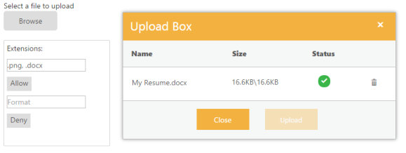

# Getting Started

This section explains briefly about how to create an UploadBox in ASP.NET Core application .

## Create your first UploadBox in ASP.NET Core

ASP.NET Core UploadBox provides support to upload the files or photos within your web page. From the following guidelines, you can learn how to upload the file that is used in a Resume Upload scenario. This helps you to restrict some file extensions, while uploading the resume in the server by using UploadBox control. The following screenshot demonstrates the functionality of UploadBox with file extension.

In the above screenshot, you can upload a resume. It allows .png and .docx file extension. This enables you to avoid unsupported resume formats to be uploaded in the server.

### Create UploadBox widgets

ASP.NET Core UploadBox basically renders built-in features like upload multiple files, and deletes the files from Uploadbox. You can know the status of the file whether it is complete or fail and also can retry the upload if it failed. You can easily create the UploadBox widget by using the following steps.

You can create a Core Project and add necessary assembly and script with the help of the given [Dotnet Core-Getting Started](https://help.syncfusion.com/aspnet-core/getting-started) Documentation.

Add the following code example to the corresponding view page to render the UploadBox.



/*ej-Tag Helper code to render Uploadbox*/

<ej-upload-box id="UploadDefault" save-url="//mvc.syncfusion.com/Services/FileUpload/UploadBox/saveFiles" remove-url="//mvc.syncfusion.com/Services/FileUpload/UploadBox/removeFiles"></ej-upload-box>





/*Razor code to render Uploadbox*/

@Html.EJ().Uploadbox("UploadDefault").SaveUrl(@Url.Action("SaveDefault")).RemoveUrl(@Url.Action("RemoveDefault"))



N> To render the Uploadbox Control you can use either Razor or Tag helper code as given in the above code snippet.

Execute the project to render the following output for the given steps. The file is being uploaded.

UploadBox after uploading
{:.caption}

## Set Restriction for File Extension

In a real-time scenario, some file extensions are restricted. You can either allow files or restrict files by using **extensionsAllow** and **extensionsDeny** respectively in **Uploadbox**. 

Add the following elements in the view page. 



/*ej-Tag Helper code to render Uploadbox*/

    <table id="uploadTable">
        <tr>
            <td>
                Extensions:
            </td>
            <td></td>
        </tr>
        <tr>
            <td>
                <input type="text" id="fileallow" class="ejinputtext" placeholder="Format" /> 
                 <ej-button id="upbutton1" text="Allow" click="allowfiletype"/>
            </td>
            <td></td>
        </tr>
        <tr>
            <td>
                <input type="text" id="filedeny" class="ejinputtext" placeholder="Format" /> 
                 <ej-button id="upbutton2" text="Deny" click="denyfiletype"/>
            </td>
            <td> 
               <ej-upload-box id="UploadDefault" save-url="//mvc.syncfusion.com/Services/FileUpload/UploadBox/saveFiles" remove-url="//mvc.syncfusion.com/Services/FileUpload/UploadBox/removeFiles"></ej-upload-box>         
            </td>
        </tr>
    </table>





/*Razor code to render Uploadbox*/

    <table id="uploadTable">
        <tr>
            <td>
                Extensions:
            </td>
            <td></td>
        </tr>
        <tr>
            <td>
                <input type="text" id="fileallow" class="ejinputtext" placeholder="Format" />
                @(Html.EJ().Button("upbutton1").Text("Allow").ClientSideEvents(c => c.Click("allowfiletype")))
            </td>
            <td></td>
        </tr>
        <tr>
            <td>
                <input type="text" id="filedeny" class="ejinputtext" placeholder="Format" />
                @(Html.EJ().Button("upbutton2").Text("Deny").ClientSideEvents(c => c.Click("denyfiletype")))
            </td>
            <td>
               @Html.EJ().Uploadbox("UploadDefault").SaveUrl(@Url.Action("SaveDefault")).RemoveUrl(@Url.Action("RemoveDefault")))
            </td>
        </tr>
    </table>



Add the following code example in script section.



 var uploadobject;
    $(function () {
        uploadobject = $("#UploadDefault").data("ejUploadbox");
        $("#upbutton1").ejButton({
            click: "allowfiletype",
        });
        $("#upbutton2").ejButton({
            click: "denyfiletype",
        });
    });
    function allowfiletype() {
        uploadobject.option('extensionsAllow', $("#fileallow").val());
        uploadobject.option('extensionsDeny', "");
    }
    function denyfiletype() {
        uploadobject.option('extensionsAllow', "");
        uploadobject.option('extensionsDeny', $("#filedeny").val());
    }



Add the given styles to display the **Uploadbox** with margin alignments.



    #targetElement {
        width: 520px;
        height: 500px;
        margin: 0 auto;
    }
    #UploadDefault {
        float: right;
    }
    #uploadTable {
        width: 100%;
    }
    #fileallow, #filedeny {
        width: 150px;
        height: 20px;
        padding: 5px;
    }



N> You can restrict one or more different extension files by giving file extension separated by comma (,)

The following screenshot displays an **Uploadbox** control with the file extension.

 

The above screenshot shows the **Uploadbox** that allows “.**docx**” and “**.png”** files. 

### Upload Multiple Files

To upload multiple files in UploadBox control, click the Browse button and select multiple files from file explorer window

The following screenshot displays an UploadBox control with multiple files selected.



/*ej-Tag Helper code to render Uploadbox*/

<ej-upload-box id="UploadDefault" save-url="//mvc.syncfusion.com/Services/FileUpload/UploadBox/saveFiles" remove-url="//mvc.syncfusion.com/Services/FileUpload/UploadBox/removeFiles" multiple-files-selection="true"></ej-upload-box>





/*Razor code to render Uploadbox*/

@Html.EJ().Uploadbox("UploadDefault").SaveUrl(@Url.Action("Save")).RemoveUrl(@Url.Action("Remove")).MultipleFilesSelection(true)



