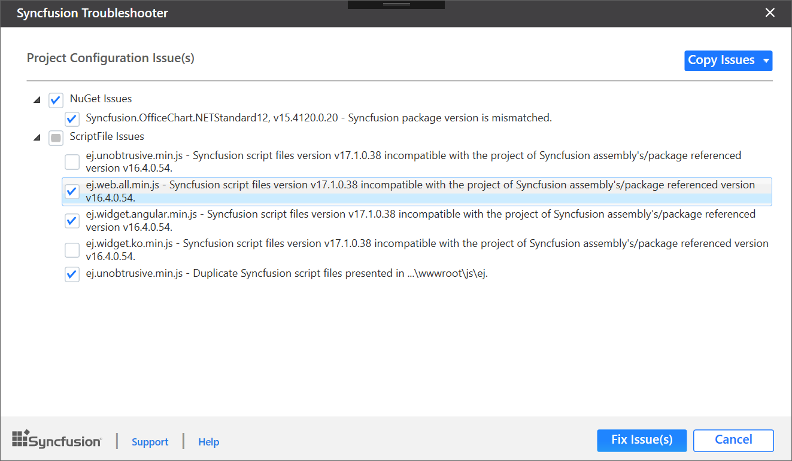

# Troubleshoot the project

Troubleshoot the project with the Syncfusion configuration and apply the fix like, wrong .NET Framework version of added Syncfusion assembly to the project or missing any Syncfusion dependent assembly of a referred assembly. The Syncfusion Troubleshooter can do the following:

* Report the Configuration issues.  

* Apply the solution

## Report the Configuration issues

The following steps help you to utilize the Syncfusion Troubleshooter by Visual Studio. 

> Before use the Syncfusion Troubleshooter for ASP.NET Core (Essential JS 1), check whether the **Syncfusion Essential JS1 AspNet Core VSExtensions** installed or not in Visual Studio Extension Manager by clicking on the Tools -> Extensions and Updates -> Installed for Visual Studio 2017 or lower and for Visual Studio 2019 by clicking on the Extensions -> Manage Extensions -> Installed. 

1. To open Syncfusion Troubleshooter Wizard, follow either one of the options below: 
   
   **Option 1**  
   Open an existing Syncfusion ASP.NET Core Application, Click **Syncfusion Menu** and choose **Essential Studio for ASP.NET Core (EJ1) > Troubleshoot…** in Visual Studio.

   

   N> In Visual Studio 2019, Syncfusion menu is available under Extensions in Visual Studio menu.

   **Option 2**  
   Right-click the Project file in Solution Explorer, then select the command Syncfusion Troubleshooter…

   

2. Now, analyze the project and it will report the project configuration issues of Syncfusion controls in the Troubleshooter dialog if any issues found. If the project does not have any configuration issues, the dialog box will show there is no configuration changes required in following areas:

    * Syncfusion NuGet Packages. 

    * Syncfusion Script files.

   

   I> The Syncfusion Troubleshooter command will be visible only for Syncfusion projects that means the project should contain Syncfusion assemblies or Syncfusion NuGet packages referred.

The Syncfusion Troubleshooter handles the following project configuration issues: 

1. NuGet related issues.

2. Script file related issues.

### NuGet issues

The Syncfusion Troubleshooter deals with the following NuGet package related issues in Syncfusion projects. 

1. Multiple versions of Syncfusion NuGet Packages are installed. If Syncfusion NuGet Package version is differed from other Syncfusion NuGet Package version, the Syncfusion Troubleshooter will show Syncfusion NuGet package version is mismatched. 

   **For Instance:** Syncfusion Web platform packages installed multiple version (v16.4.0.54 & v17.1.0.38), the Syncfusion Troubleshooter will show Syncfusion package version mismatched.
 
   

### Script file issues

The Syncfusion Troubleshooter deals with the following Script file related issues in Syncfusion projects. 

1. Syncfusion script file version mismatched. Each Syncfusion script file version will be compared with corresponding referred Syncfusion assembly latest version in the application. 

   **For Instance:** If Syncfusion assemblies (v17.1450.0.38) referred in project and Syncfusion script file (v16.4.0.54) referred in project. The Syncfusion Troubleshooter will show Syncfusion script file version (v16.4.0.54) incompatible with the project of Syncfusion assembly’s/package version (v17.1.0.38).
 
   

   **For Instance:** If Syncfusion assemblies (v17.1450.0.38) referred in project, but Syncfusion script file version (v16.4.0.54) in View files when referred script files by CDN link. The Syncfusion Troubleshooter will show Syncfusion script file version (v16.4.0.54) incompatible with the project of Syncfusion assembly’s/package version (v17.1.0.38) from CDN.

   

2. Duplicate Syncfusion script files. Syncfusion Troubleshooter will show the duplicate script files when Syncfusion script file presented in project location, which is referred in View files by CDN link or Syncfusion script files are presented in multiple location in same project.

   **For Instance:** If project have “ej.web.all.min.js” script file entry in View file and also “ej.web.all.min.js” script file available in project location (Scripts\ej), the Syncfusion Troubleshooter will show duplicate Syncfusion script files presented in \Scripts\ej, due to this script file referred from CDN.
  
   

   **For Instance:** If project have “ej.web.all.min.js” script file available in multiple project location ("\Scripts\ej\" and "\Scripts\"), the Syncfusion Troubleshooter will show Duplicate Syncfusion script files presented in \Scripts.
  
   

## Apply the solution

1. After loading the Syncfusion Troubleshooter dialog, check the corresponding check box of the issue to be resolved. Then, click the “Fix Issue(s)” button. 

   

2. A dialog appears, which will ask to take a backup of the project before performing the troubleshooting process. If you need to backup the project before troubleshooting, click “Yes” button. 

   

3. Wait for a while, the Syncfusion Troubleshooter is resolving the selected issues. After the troubleshooting process completed, there will be a status message in the Visual Studio status bar as “Troubleshooting process completed successfully”.

   

4. Then, Syncfusion licensing registration required message box will be shown, if you installed the trial setup or NuGet packages since Syncfusion introduced the licensing system from 2018 Volume 2 (v16.2.0.41) Essential Studio release. Navigate to the  [help topic](https://help.syncfusion.com/common/essential-studio/licensing/license-key#how-to-generate-syncfusion-license-key), which is shown in the licensing message box to generate and register the Syncfusion license key to your project. Refer to this [blog](https://blog.syncfusion.com/post/Whats-New-in-2018-Volume-2-Licensing-Changes-in-the-1620x-Version-of-Essential-Studio.aspx) post for understanding the licensing changes introduced in Essential Studio.   

   