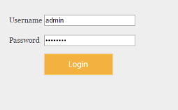
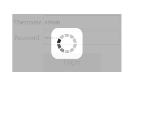
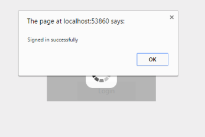

layout: post
title: WaitingPopup | WaitingPopup | ASP.NET Core | Syncfusion
description: overview
platform: aspnet-core
control: WaitingPopup
documentation: ug
---

# WaitingPopup

The WaitingPopup control for ASP.NET Core is a visual element that provides support for displaying a pop-up indicator over a target area and preventing the end user's interaction with the target area while loading. 

### Key Features

* Custom text: Supports custom text inside the pop-up panel.
* Template: Supports including HTML content instead of the default image.
* Transparency: Supports customizing the transparency and opacity level.
* Themes: JavaScript controls include 12 built-in themes (6 flat and 6 gradient effects) and also support the custom skin option to set user-defined themes.

## Getting Started

This section explains briefly about how to create a WaitingPopup in your application with ASP.NET Core.

## Create your first Waiting Popup in ASP.NET Core

ASP.NET Core Waiting Popup provides support to display Waiting Popup within your web page. From the following guidelines, you can learn how to create a Waiting Popup in a real-time Login page scenario. This helps you in authentication model. The following screenshot illustrates the functionality of a Waiting Popup in a Login page scenario.

In the above screenshot, you can give the Username and Password. When you click the Login button, the Waiting Popup appears.  After loading, the alert box appears with a message “Signed in successfully”.

### Create Waiting Popup

ASP.NET Core Waiting Popup widget has a built-in feature to block all other actions until the page is loaded. You can easily create the Waiting Popup control by using simple HTML Helper element as follows

1. You can create a Core Project and add necessary assembly and script with the help of the given [Dotnet Core-Getting Started](https://help.syncfusion.com/aspnet-core/getting-started) Documentation.

### Create Login Page

In a real-time Login page scenario, when you click on the Login button, the Waiting Popup is displayed. This is achieved by using the button Click.

1. Add the following code example to the corresponding view page to create Login page with username and password.




	
	

		

		

			<table id="target">

			<tr>

				<td>Username</td>

				<td><input type="text"></td>

			</tr>

			<tr>

				<td>Password</td>

				<td><input type="password"></td>

			</tr>

			<tr>

				<td></td>                       

			 <td>                         
			  
             <ej-button id="buttonnormal" text="Login" size="@ButtonSize.Large" create="btnLoad" click="btnClick"/>       
             
			 </td>                    
 
            <ej-waiting-popup id="target" show-on-init ="false" /> 

			</tr>

			</table>

		

		

	

  

  
   
	

		

		

			<table id="target">

			<tr>

				<td>Username</td>

				<td><input type="text"></td>

			</tr>

			<tr>

				<td>Password</td>

				<td><input type="password"></td>

			</tr>

			<tr>

				<td></td>                       

			 <td>                         
			 
			 @{ Html.EJ().Button("buttonnormal").Text("Login").Size(ButtonSize.Large).ClientSideEvents(e =>e.Create("btnload").Click("btnClick")).Render(); }

			 </td>                    

			@{ Html.EJ().WaitingPopup("target").ShowOnInit(false).Render(); }

			</tr>

			</table>

		

		

	

	 



2. Add the following styles in the view page to show the Waiting Popup.

 

	

  
   

3. Add the following script in the view page.



	
		

   

4. The following screenshot displays the User login.

   

5. The following screenshot shows the Waiting Popup

   

The following screenshot displays an alert box displayed with the message “Signed in successfully” after loading.

